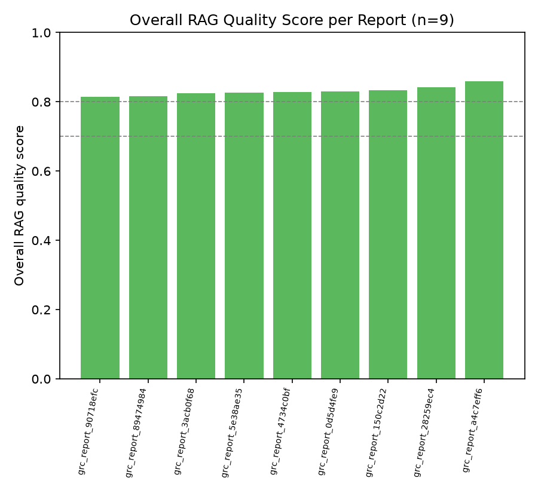
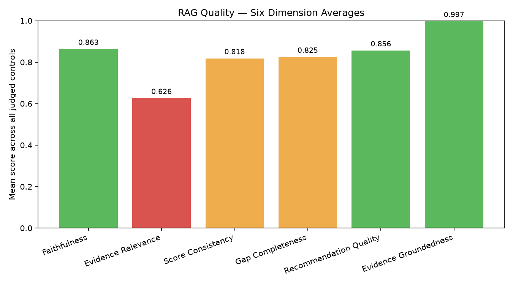
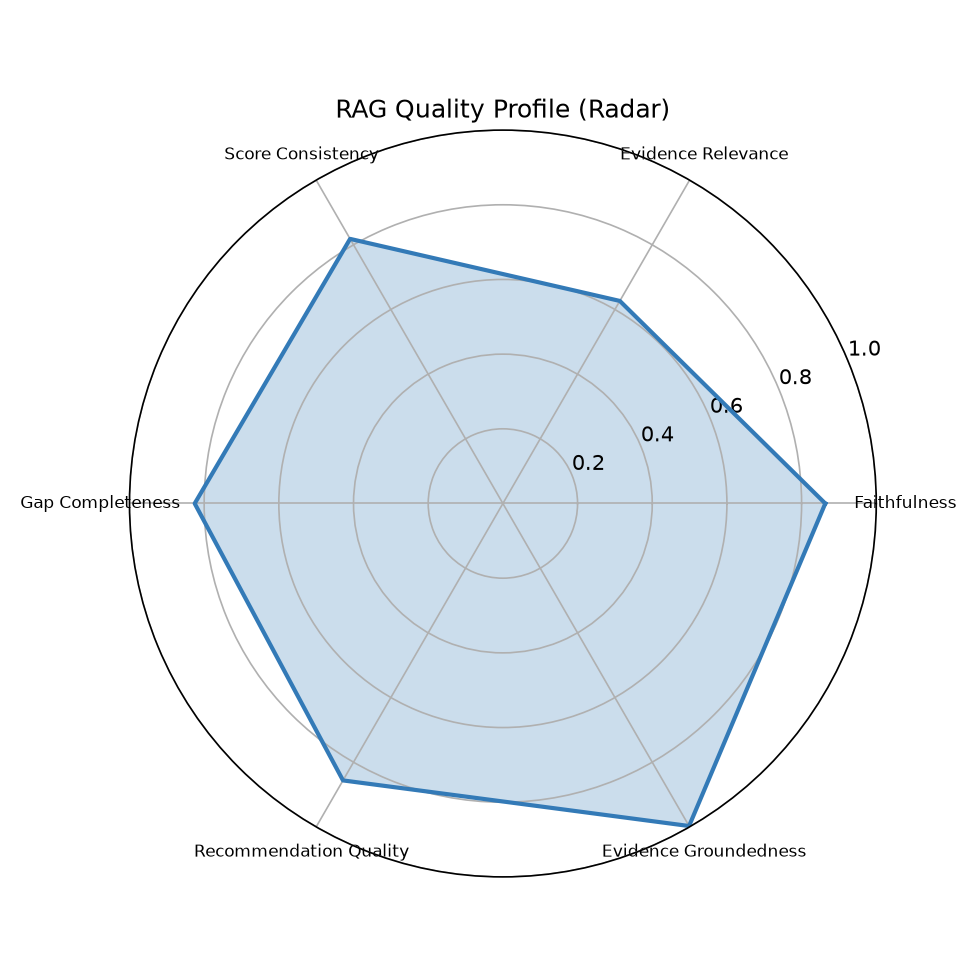
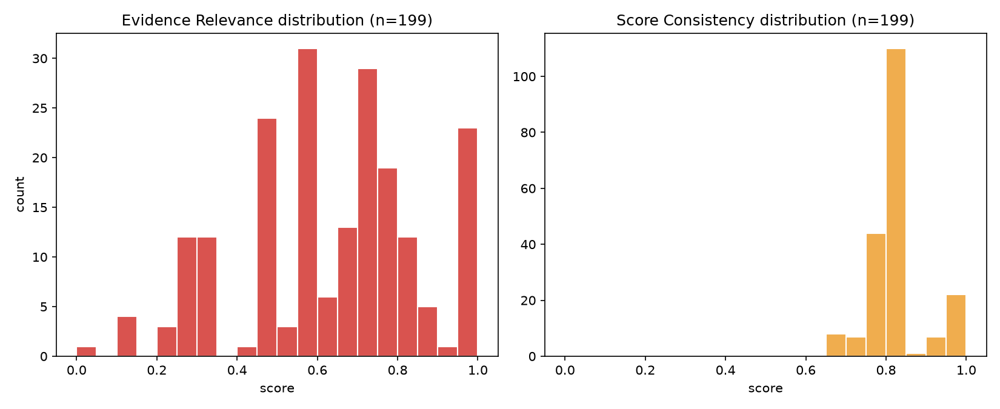
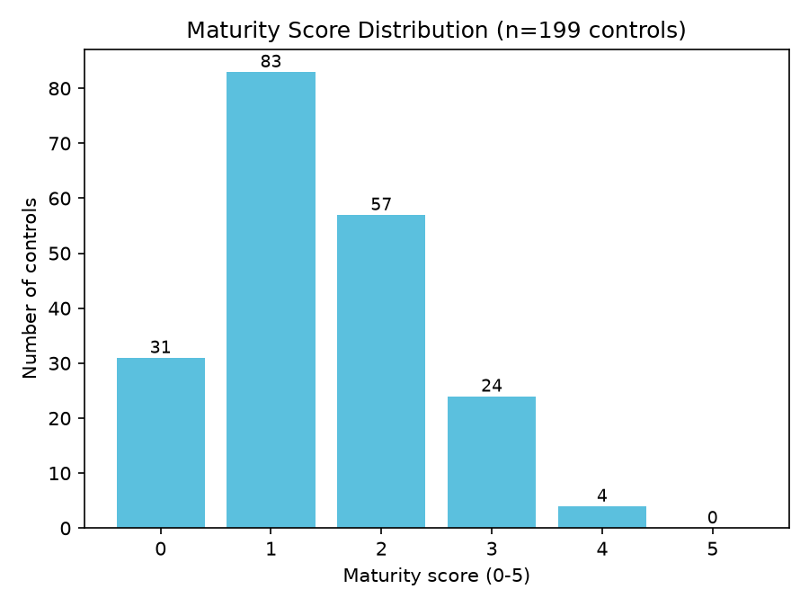

# RAG Quality Report

- Generated: 2026-07-14 01:26 UTC
- Source folder (scanned recursively): `/home/cyberschnell/Documents/GRC-LLM-2/DeptEduc_Anthrop_framework_reports`
- RAGAS eval reports found: **9**
- GRC assessment JSON files found: **9**
- Total controls judged (RAGAS): **199**
- Frameworks covered (eval reports): cis_csc, cmmc, csa_ccm, ftc_safeguards, hipaa, iso_27001, nist_800_53, nist_csf, pci_dss

## Overall RAG Quality Score per Report

| Report | Frameworks | Controls | Overall Score | Label |
|---|---|---|---|---|
| grc_report_90718efc_rag_eval.txt | cmmc | 20 | 0.815 | Good |
| grc_report_89474984_rag_eval.txt | iso_27001 | 24 | 0.817 | Good |
| grc_report_3acb0f68_rag_eval.txt | ftc_safeguards | 16 | 0.824 | Good |
| grc_report_5e38ae35_rag_eval.txt | nist_csf | 26 | 0.827 | Good |
| grc_report_4734c0bf_rag_eval.txt | pci_dss | 23 | 0.828 | Good |
| grc_report_0d5d4fe9_rag_eval.txt | hipaa | 20 | 0.830 | Good |
| grc_report_150c2d22_rag_eval.txt | nist_800_53 | 27 | 0.834 | Good |
| grc_report_28259ec4_rag_eval.txt | cis_csc | 18 | 0.842 | Good |
| grc_report_a4c7eff6_rag_eval.txt | csa_ccm | 25 | 0.860 | Good |

**Aggregate overall score**: mean=0.831, median=0.828, min=0.815, max=0.860

## Six-Dimension Aggregate Stats (per-control, across all reports)

| Dimension | Mean | Median | Stdev | %<0.5 | %<0.7 | N |
|---|---|---|---|---|---|---|
| Faithfulness | 0.863 | 0.850 | 0.066 | 0.0% | 0.0% | 199 |
| Evidence Relevance | 0.626 | 0.650 | 0.225 | 28.6% | 55.3% | 199 |
| Score Consistency | 0.818 | 0.800 | 0.076 | 0.0% | 0.5% | 199 |
| Gap Completeness | 0.825 | 0.820 | 0.059 | 0.0% | 0.5% | 199 |
| Recommendation Quality | 0.856 | 0.850 | 0.042 | 0.0% | 0.0% | 199 |
| Evidence Groundedness | 0.997 | 1.000 | 0.027 | 0.0% | 0.5% | 199 |

## Worst-Scoring Example Controls per Dimension

**Faithfulness**
- `[0.72]` grc_report_0d5d4fe9_rag_eval.txt / 164.312(a)(1): The rationale and gaps are mostly grounded in the evidence, but several gaps (e.g., no RBAC/ABAC model, no access provisioning workflow, no periodic access review) go beyond what the evidence can confirm or deny, and the rationale correctly identifies the policy's limited scope without overstating what the evidence shows; however, Evidence [3] about privileged user responsibilities is vague and the rationale claims its absence of specificity without quoting what those responsibilities actually include, which is a minor overreach.
- `[0.72]` grc_report_150c2d22_rag_eval.txt / RA-3: The rationale correctly identifies that 'magnitude of harm' is present but 'likelihood' is not explicitly stated as a distinct factor; however, the claim that there is 'no explicit requirement for documenting assessment results' is partially contradicted by evidence [2] and [4], which reference residual risk identification, AO risk decisions, and POA&M documentation — these imply some form of result documentation.
- `[0.72]` grc_report_3acb0f68_rag_eval.txt / FTC-2: Most rationale claims are supported by evidence, but the gap asserting 'no explicit linkage between risk assessment findings and safeguard design' is partially contradicted by evidence [2] which mentions residual risk identification and AO risk decisions, and evidence [8] which describes a continuous monitoring strategy tied to cybersecurity risk posture — these imply some linkage that the gap overstates as entirely absent.

**Evidence Relevance** — weakest dimension, showing more examples
- `[0.00]` grc_report_5e38ae35_rag_eval.txt / RC.CO-3: No evidence quotes were cited, so there is nothing to evaluate for relevance to the control's requirement of communicating recovery activities to stakeholders.
- `[0.10]` grc_report_90718efc_rag_eval.txt / SC.L2-3.13.10: Both cited items are bibliography references (FIPS 140-2 and FIPS 186) that do not constitute policy language addressing cryptographic key management practices, making them essentially irrelevant as evidence for this control's specific requirements.
- `[0.15]` grc_report_4734c0bf_rag_eval.txt / PCI-3.5: The sole evidence quote is a bare citation of a cryptographic standard with no surrounding policy language tying it to PAN protection, making it only tangentially relevant to the specific control requirement of securing stored PANs.
- `[0.15]` grc_report_90718efc_rag_eval.txt / SI.L1-3.14.2: All three evidence quotes pertain exclusively to security patching and vulnerability management, which are distinct from malicious code protection mechanisms (antivirus, anti-malware, signature updates), making them largely irrelevant to the specific requirements of SI.L1-3.14.2.
- `[0.15]` grc_report_a4c7eff6_rag_eval.txt / LOG-01: The sole evidence quote references a high-level 'continuous monitoring strategy' for cybersecurity risk posture, which is only tangentially related to the specific LOG-01 requirement of defining loggable events and log management procedures, making it largely off-topic for this control.
- `[0.20]` grc_report_4734c0bf_rag_eval.txt / PCI-1.3: The cited quotes address general defense-in-depth, least-privilege, protocol restrictions, and ISA agreements for a federal IT context, none of which specifically address CDE network access controls, firewall rules, or PCI DSS segmentation requirements central to this control.
- `[0.20]` grc_report_89474984_rag_eval.txt / A.11.2: Both evidence quotes are generic policy statements about protecting PII and ED information from unauthorized access/disclosure — neither quote specifically addresses equipment siting, environmental hazards, cabling, maintenance, or physical equipment protection as required by A.11.2, making them largely off-topic for this control.
- `[0.20]` grc_report_a4c7eff6_rag_eval.txt / LOG-08: Neither evidence quote directly addresses audit log retention periods or protection from unauthorized access; quote [1] is generic compliance boilerplate and quote [2] relates to privileged function auditing rather than log retention or protection requirements.
- `[0.25]` grc_report_28259ec4_rag_eval.txt / CIS-10: The cited evidence quotes pertain primarily to patch management and general security advisories, which are only peripherally related to malware defenses (prevention, detection, and execution control of malicious code), making them largely off-target for this specific control requirement.
- `[0.25]` grc_report_4734c0bf_rag_eval.txt / PCI-1.2: The cited evidence quotes are largely peripheral to PCI-1.2's specific requirement for network security control configuration with default-deny posture — references to secure protocol limits, access control principles, ISAs/MOUs, and risk assessment do not directly address firewall/ACL configuration or traffic restriction rules.
- `[0.25]` grc_report_4734c0bf_rag_eval.txt / PCI-2.1: The three evidence quotes address general IT configuration governance, change management, and patch management, but none is specifically relevant to the control's core requirements of changing vendor-supplied defaults, removing unnecessary default accounts, or defining secure configuration processes for default credentials.
- `[0.25]` grc_report_4734c0bf_rag_eval.txt / PCI-8.2: The evidence quotes primarily address physical PIV card issuance, personnel security clearance validation, and HSPD-12 compliance, which are only tangentially related to the PCI-8.2 requirement for unique user ID assignment and account lifecycle management of system users and administrators.

**Score Consistency**
- `[0.65]` grc_report_3acb0f68_rag_eval.txt / FTC-9: A score of 3 is somewhat generous given that the evidence is drawn entirely from a non-FTC federal context and lacks specifics on transmission encryption, disposal, storage controls, and metrics; the policy demonstrates intent and governance breadth but the contextual mismatch and absence of technical specifics would more credibly support a score of 2.
- `[0.70]` grc_report_0d5d4fe9_rag_eval.txt / 164.312(a)(1): A score of 2 is defensible given the policy shows awareness of least privilege and PIV authentication but lacks specific technical procedures; however, the presence of PIV-based authentication (a strong technical control) and defined privileged user responsibilities could arguably support a 3, making the score slightly deflated relative to the evidence strength.
- `[0.70]` grc_report_0d5d4fe9_rag_eval.txt / 164.316(a): A score of 4 out of 5 is somewhat inflated given that the policy is entirely FISMA/NIST-oriented with no explicit HIPAA coverage, which is the very standard being assessed; the evidence supports a strong general policy framework but the absence of HIPAA-specific alignment is a significant gap that would more appropriately place the score at 2–3.

**Gap Completeness**
- `[0.65]` grc_report_89474984_rag_eval.txt / A.5.1: The gaps cover important missing elements like formal approval, review cycles, and metrics, but the gap claiming limited evidence of communication to external parties is partially contradicted by evidence [8] (user agreements, NDAs, Rules of Behavior), and the gaps miss an obvious control requirement: explicit evidence that the policies have actually been approved and published (not just drafted), which is the core of A.5.1.
- `[0.70]` grc_report_0d5d4fe9_rag_eval.txt / 164.308(a)(2): The gaps correctly identify the absence of a named HIPAA security official and the FISMA vs. HIPAA framing issue, but they are somewhat redundant (gaps 1 and 3 essentially repeat the same point) and miss the requirement to assess whether the designation is documented and maintained over time as personnel change, which appears only superficially in recommendations rather than gaps.
- `[0.70]` grc_report_150c2d22_rag_eval.txt / AT-1: The gaps comprehensively cover key AT-1 requirements such as standalone policy, procedures, review cycles, and dissemination, but the gap asserting no designated official is responsible is partially contradicted by evidence quote [5], and the gap about metrics/effectiveness measurement, while valid, goes beyond the core AT-1 control requirement which focuses on development, documentation, and dissemination rather than program effectiveness evaluation.

**Recommendation Quality**
- `[0.75]` grc_report_150c2d22_rag_eval.txt / IA-5: Most recommendations are specific and directly address the identified gaps (password complexity parameters, PKI lifecycle, default authenticator changes), but the final recommendation about 'metrics and monitoring' is not tied to any identified gap and reads as boilerplate, slightly reducing overall quality.
- `[0.78]` grc_report_0d5d4fe9_rag_eval.txt / 164.312(a)(1): Recommendations are specific and actionable, directly mapping to identified gaps (e.g., quarterly/semi-annual recertification cadence, emergency access audit trails), though the encryption/decryption recommendation addresses a control specification not central to 164.312(a)(1) and could be more precisely scoped to the access granting/revoking workflow gaps.
- `[0.78]` grc_report_150c2d22_rag_eval.txt / RA-3: Recommendations are mostly specific and actionable — referencing NIST SP 800-30, specifying CSAM as a storage repository, and defining roles for dissemination — though the suggestion to increase frequency to annually is presented as a best-practice suggestion without direct grounding in a specific identified gap, making it slightly less targeted.

**Evidence Groundedness**
- `[0.67]` grc_report_4734c0bf_rag_eval.txt / PCI-4.2: 2/3 quotes located in PDF  [WARNING: possible hallucinated citations]
- `[0.80]` grc_report_3acb0f68_rag_eval.txt / FTC-3.3: 4/5 quotes located in PDF  [WARNING: possible hallucinated citations]
- `[1.00]` grc_report_0d5d4fe9_rag_eval.txt / 164.308(a)(1): 6/6 quotes located in PDF

## Maturity Score Distribution (from GRC assessment JSONs)

Total controls: 199, mean maturity: 1.43 / 5

| Maturity | Count | % |
|---|---|---|
| 0 | 31 | 15.6% |
| 1 | 83 | 41.7% |
| 2 | 57 | 28.6% |
| 3 | 24 | 12.1% |
| 4 | 4 | 2.0% |
| 5 | 0 | 0.0% |

## Charts

## LLM Expert Analysis

# Expert RAG/GRC Quality Analysis

## 1. Overall RAG Quality Verdict

The system delivers **above-average but uneven RAG performance** (mean 0.831, range 0.815–0.860 across nine reports). The narrow inter-report spread suggests consistent pipeline behavior, not lucky outliers. However, the aggregate score masks a severe structural weakness in retrieval that undermines the validity of a meaningful fraction of assessments. The system is not failing catastrophically, but it is not trustworthy enough for unreviewed compliance decisions.

---

## 2. Strongest and Weakest Dimensions

**Strongest: Evidence Groundedness (mean=0.997)** — citations are almost universally traceable to source PDFs. This confirms the generation stage is not fabricating quotations wholesale; when evidence is retrieved, it is real text. The two flagged hallucination warnings (PCI-4.2 at 0.67, FTC-3.3 at 0.80) are isolated but warrant a zero-tolerance policy given compliance stakes.

**Also strong: Faithfulness (0.863), Recommendation Quality (0.856), Gap Completeness (0.825), Score Consistency (0.818)** — all cluster tightly (stdev ≤ 0.076) with near-zero sub-0.7 rates. Generation and prompting logic is working well: when the retrieved context is adequate, the LLM reasons faithfully, writes actionable recommendations, and identifies gaps with reasonable completeness.

**Critical weakness: Evidence Relevance (mean=0.626, median=0.650, stdev=0.225)** — this is the system's single dominant failure mode. **28.6% of controls score below 0.5, and 55.3% score below 0.7**, meaning more than half of all assessments are built on marginally or poorly relevant evidence. The examples are diagnostic: the retriever is returning bibliography entries (FIPS 140-2 citations with no surrounding policy prose), generic organizational boilerplate, and federal FISMA/NIST content that is cross-mapped to PCI DSS or FTC Safeguards Rule controls where it does not apply. This is a **retrieval problem**, not a generation problem — the high Faithfulness score confirms the LLM faithfully uses what it is given; it simply receives the wrong material too often. The high Groundedness score further confirms the embeddings are locating real document text; the issue is semantic mismatch between control-requirement queries and indexed document chunks.

**Secondary concern: Faithfulness floor at 0.72** — the worst examples show the LLM asserting gap claims (e.g., "no RBAC/ABAC model," "no access provisioning workflow") that the retrieved evidence cannot support or directly contradicts. This is a **hallucination-of-absence** pattern: the model infers missing controls rather than limiting claims to what evidence confirms. This is dangerous in GRC contexts where a false gap can trigger unnecessary remediation spend.

---

## 3. Maturity Score Calibration

The distribution (mean=1.43; modal bin=1; zero scores of 5; only 4 scores of 4) skews **low but is probably not systematically deflated** — it likely reflects genuine immaturity of the assessed organizations' documented controls (many appear to be federal agencies mapping FISMA policies onto PCI or HIPAA frameworks for which they were not written). However, two calibration concerns exist:

- **Upward outliers are plausible inflation:** Score Consistency worst cases include a 4/5 for a "strong FISMA policy with no explicit HIPAA coverage" (report 0d5d4fe9 / 164.316(a)) and a 3/5 where evidence is drawn entirely from a non-FTC federal context. With 55% of evidence relevance scores below 0.7, any maturity score above 2 deserves extra scrutiny — the LLM may be rewarding policy *sophistication in the retrieved text* rather than *applicability to the assessed framework*.
- **Score Consistency stdev of 0.076 is reassuring** — there is no wholesale inflation; scoring logic is internally coherent. The risk is moderate, not systemic.

---

## 4. Prioritized Recommendations

**Priority 1 — Fix the retriever (highest impact, addresses 55% sub-0.7 evidence relevance).**
Implement control-specific query expansion: prepend each retrieval query with the control's domain keywords (e.g., "cryptographic key management" for SC.L2-3.13.10, "malicious code / antivirus" for SI.L1-3.14.2) rather than relying on the raw control ID. Add a post-retrieval relevance filter using a cross-encoder reranker with a minimum threshold (suggested: cosine similarity ≥ 0.4 after reranking) before chunks are passed to the LLM. For controls returning zero relevant chunks, surface an explicit "insufficient evidence" flag rather than passing bibliographic chaff.

**Priority 2 — Suppress gap hallucination (addresses Faithfulness floor at 0.72).**
Add a system-prompt constraint: "Only assert a gap if the evidence explicitly contradicts or fails to mention the requirement; do not infer absence from silence." Consider a post-generation verification step that checks each gap assertion against cited evidence chunks and flags ungrounded absence claims.

**Priority 3 — Enforce citation grounding (zero-tolerance for hallucinated quotes).**
The two hallucinated citation instances (PCI-4.2, FTC-3.3) are low-frequency but unacceptable in a compliance context. Implement automated PDF spot-checking for all reports before delivery, and configure the pipeline to retry generation with a higher temperature penalty on citation fabrication when verification fails.

**Priority 4 — Calibrate cross-framework scoring.**
When a source document is clearly scoped to one framework (FISMA/NIST) but assessed against another (HIPAA, PCI, FTC), apply a framework-mismatch penalty to the maturity score or inject a mandatory disclaimer. This directly addresses the 164.316(a) inflation case and similar cross-framework mismatches.

**Priority 5 — Extend evaluation corpus.**
Nine reports and 199 controls is sufficient for this initial audit but too small to validate calibration across the full control population. Expand RAGAS evaluation to ≥500 controls across ≥5 distinct framework pairings to detect any dimension-specific degradation patterns not visible at current scale.
