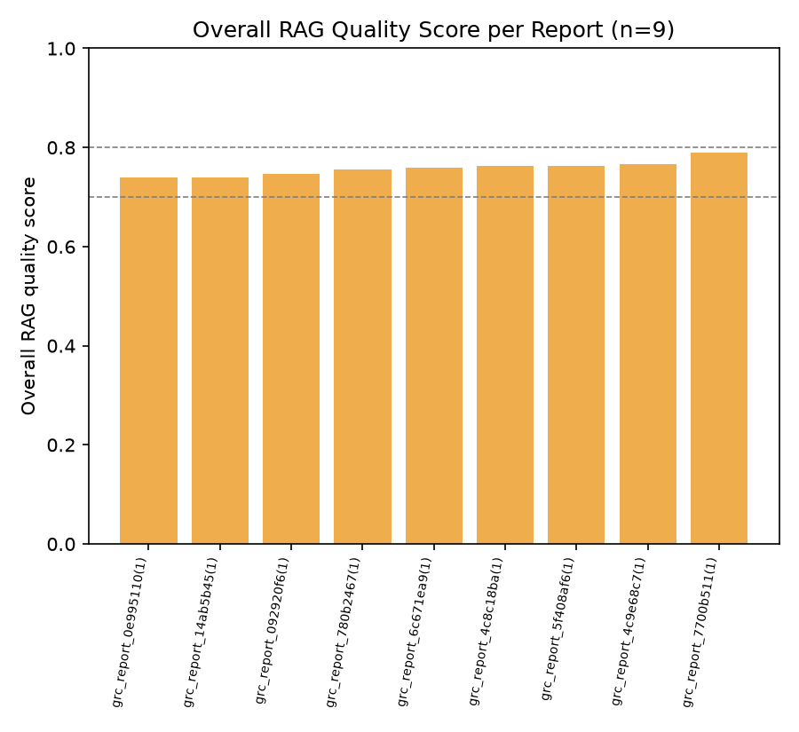
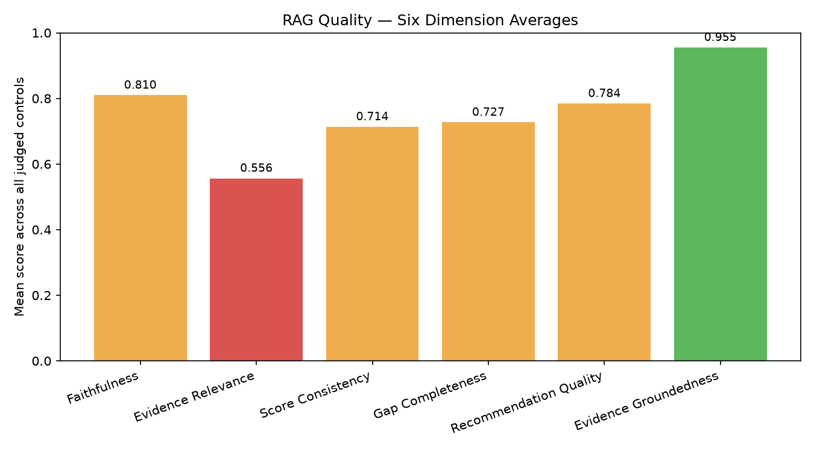
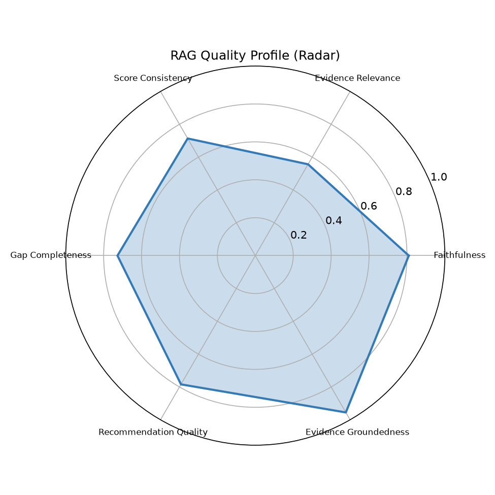
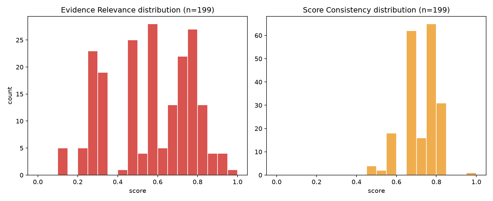
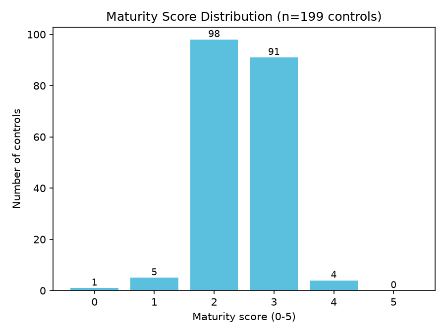

# RAG Quality Report

- Generated: 2026-07-14 01:28 UTC
- Source folder (scanned recursively): `/home/cyberschnell/Documents/GRC-LLM-2/DeptEduc_GPT_4.1_framework_reports`
- RAGAS eval reports found: **9**
- GRC assessment JSON files found: **9**
- Total controls judged (RAGAS): **199**
- Frameworks covered (eval reports): cis_csc, cmmc, csa_ccm, ftc_safeguards, hipaa, iso_27001, nist_800_53, nist_csf, pci_dss

## Overall RAG Quality Score per Report

| Report | Frameworks | Controls | Overall Score | Label |
|---|---|---|---|---|
| grc_report_0e995110(1)_rag_eval.txt | cis_csc | 18 | 0.739 | Acceptable |
| grc_report_14ab5b45(1)_rag_eval.txt | pci_dss | 23 | 0.740 | Acceptable |
| grc_report_092920f6(1)_rag_eval.txt | hipaa | 20 | 0.746 | Acceptable |
| grc_report_780b2467(1)_rag_eval.txt | csa_ccm | 25 | 0.756 | Acceptable |
| grc_report_6c671ea9(1)_rag_eval.txt | iso_27001 | 24 | 0.760 | Acceptable |
| grc_report_4c8c18ba(1)_rag_eval.txt | cmmc | 20 | 0.762 | Acceptable |
| grc_report_5f408af6(1)_rag_eval.txt | nist_800_53 | 27 | 0.762 | Acceptable |
| grc_report_4c9e68c7(1)_rag_eval.txt | nist_csf | 26 | 0.766 | Acceptable |
| grc_report_7700b511(1)_rag_eval.txt | ftc_safeguards | 16 | 0.790 | Acceptable |

**Aggregate overall score**: mean=0.758, median=0.760, min=0.739, max=0.790

## Six-Dimension Aggregate Stats (per-control, across all reports)

| Dimension | Mean | Median | Stdev | %<0.5 | %<0.7 | N |
|---|---|---|---|---|---|---|
| Faithfulness | 0.810 | 0.820 | 0.053 | 0.0% | 1.0% | 199 |
| Evidence Relevance | 0.556 | 0.550 | 0.208 | 39.2% | 64.3% | 199 |
| Score Consistency | 0.714 | 0.720 | 0.083 | 2.0% | 25.1% | 199 |
| Gap Completeness | 0.727 | 0.720 | 0.063 | 0.0% | 17.1% | 199 |
| Recommendation Quality | 0.784 | 0.800 | 0.056 | 0.0% | 5.0% | 199 |
| Evidence Groundedness | 0.955 | 1.000 | 0.112 | 0.0% | 5.5% | 199 |

## Worst-Scoring Example Controls per Dimension

**Faithfulness**
- `[0.55]` grc_report_780b2467(1)_rag_eval.txt / CEK-04: The rationale claims the policy 'references' FIPS 140-2 and NIST standards but then asserts no explicit requirements exist; however, Evidence [1] directly cites FIPS PUB 140-2 and Evidence [2] references TLS, which at minimum demonstrate some alignment — the rationale somewhat contradicts itself by acknowledging these references while simultaneously claiming no explicit requirement, and Evidence [3] about security contracting language is used to support gaps without clear logical derivation.
- `[0.62]` grc_report_780b2467(1)_rag_eval.txt / AIS-01: The rationale claims the policy assigns responsibilities, requires documentation, maintains inventories, and requires periodic reviews, but the evidence quotes only partially support this — specifically, inventory maintenance and periodic review processes are not clearly demonstrated in the cited excerpts, making some rationale claims unsupported by the actual evidence provided.
- `[0.72]` grc_report_092920f6(1)_rag_eval.txt / 164.308(a)(7): The rationale correctly notes the policy references risk assessments, criticality analysis, and NIST SP 800-53 alignment, which are supported by the evidence quotes, but the claim that the policy 'references performing...criticality analysis' is only loosely supported by quote [3] which mentions sensitivity/criticality levels for systems and data rather than a contingency-specific criticality analysis; no evidence quote contradicts the stated gaps, so the assessment is largely faithful though slightly overstated in connecting NIST references to contingency planning.

**Evidence Relevance** — weakest dimension, showing more examples
- `[0.10]` grc_report_14ab5b45(1)_rag_eval.txt / PCI-5.1: Neither evidence quote directly addresses anti-malware solutions, deployment coverage, or malware protection mechanisms — they are generic policy references to continuous monitoring and NIST SP 800-53 categorization that do not substantively speak to PCI-5.1's requirements.
- `[0.10]` grc_report_5f408af6(1)_rag_eval.txt / AU-12: Neither evidence quote addresses audit record generation, selection of auditable events, or audit record locations — they cover general NIST SP 800-53 compliance posture and PIV-based automation, making them largely irrelevant to the specific requirements of AU-12.
- `[0.15]` grc_report_092920f6(1)_rag_eval.txt / 164.312(b): None of the three cited excerpts directly address audit controls, audit logging, or recording/examining ePHI system activity — they cover general NIST guidance, contracting language, and performance assessment, making them largely irrelevant to the specific requirements of 164.312(b).
- `[0.15]` grc_report_780b2467(1)_rag_eval.txt / BCR-01: All four evidence quotes address general information security policy, system inventory, and cybersecurity documentation requirements — none specifically address business continuity management, BCM planning, testing, or related procedures, making them largely irrelevant to BCR-01.
- `[0.15]` grc_report_780b2467(1)_rag_eval.txt / LOG-08: None of the three cited evidence quotes directly address audit log retention periods, retention practices, or protection of audit logs from unauthorized access — they cover general NIST guidance adherence, procurement security clauses, and POA&M tracking, making them largely off-topic for this specific control.
- `[0.20]` grc_report_092920f6(1)_rag_eval.txt / 164.310(d)(1): None of the three quoted excerpts directly addresses the receipt, removal, tracking, or handling of physical hardware or electronic media containing ePHI — they relate to data dissemination, privacy control assessments, and general outreach/training, making them largely tangential to the specific control requirement.
- `[0.20]` grc_report_14ab5b45(1)_rag_eval.txt / PCI-3.5: The cited evidence consists of generic references to NIST SP 800-53, FIPS 140-2, and general PII/sensitivity controls that do not directly address PAN storage or cryptographic rendering requirements specific to PCI DSS 3.5, making them largely tangential to the control.
- `[0.20]` grc_report_5f408af6(1)_rag_eval.txt / SI-3: None of the five evidence quotes specifically address malicious code protection, entry/exit point scanning, antivirus/anti-malware tools, or automated definition updates — they are generic governance, monitoring, and access agreement statements with no direct relevance to SI-3 requirements.
- `[0.20]` grc_report_6c671ea9(1)_rag_eval.txt / A.8.3: None of the three cited excerpts directly address removable media handling, classification scheme application, or media management procedures; they cover general scope, funding responsibilities, and asset listing, making them only tangentially related to the specific control requirement.
- `[0.20]` grc_report_780b2467(1)_rag_eval.txt / TVM-01: None of the four evidence quotes specifically address antivirus or anti-malware configuration, definition updates, or scanning — they cover general continuous monitoring, procurement language, SSP validation, and NIST control selection, making them only tangentially related to TVM-01's requirements.
- `[0.25]` grc_report_092920f6(1)_rag_eval.txt / 164.310(a)(1): All four evidence quotes address logical/information access controls (least privilege, personnel screening, PII protection, system privileges) rather than physical facility access controls specifically required by 164.310(a)(1), making them largely off-topic for this control's requirements.
- `[0.25]` grc_report_092920f6(1)_rag_eval.txt / 164.310(b): The cited evidence quotes relate to general IT security configuration, PII protection controls, user agreements, and security training — none of them specifically address workstation use policies, proper workstation functions, or physical attributes of workstation surroundings as required by this control.

**Score Consistency**
- `[0.45]` grc_report_0e995110(1)_rag_eval.txt / CIS-2: A score of 2 implies a developing/ad-hoc capability with some relevant elements, but the evidence quotes are largely about general asset and system-level inventories with no software-specific controls; a score of 1 would better reflect the near-complete absence of software asset management requirements.
- `[0.45]` grc_report_5f408af6(1)_rag_eval.txt / AU-12: A maturity score of 2 is somewhat inflated given that the two evidence quotes provide no substantive coverage of AU-12's core requirements (audit record generation, event selection, defined locations); a score of 0–1 would be more consistent with the near-total absence of relevant evidence.
- `[0.45]` grc_report_6c671ea9(1)_rag_eval.txt / A.17.1: A score of 3 (defined/implemented) is inflated given that the evidence quotes show no direct coverage of information security continuity requirements in adverse situations; the evidence at best demonstrates general security management practices, which would more appropriately support a score of 1–2.

**Gap Completeness**
- `[0.50]` grc_report_4c8c18ba(1)_rag_eval.txt / AC.L1-3.1.1: The identified gaps focus on continuous improvement and metrics, which are not explicitly required by AC.L1-3.1.1; meanwhile, the assessment misses more relevant gaps such as no explicit mention of device/process authorization mechanisms, no evidence of technical enforcement controls (e.g., access control lists, identity management systems), and no description of how unauthorized access attempts are handled.
- `[0.55]` grc_report_5f408af6(1)_rag_eval.txt / AT-3: The first gap claiming no pre-authorization requirement is directly contradicted by Evidence [4], which is a significant accuracy failure; the remaining gaps around content specificity, periodicity, and effectiveness metrics are legitimate and not addressed by the evidence.
- `[0.55]` grc_report_780b2467(1)_rag_eval.txt / AIS-01: The gaps correctly identify missing metrics, continuous improvement, and formal approval/communication processes, but miss an obvious gap: no evidence of a dedicated application security policy document itself, and the control's requirement for 'applying' and 'maintaining' application security procedures is not addressed as a gap despite being unsupported by evidence.

**Recommendation Quality**
- `[0.55]` grc_report_4c8c18ba(1)_rag_eval.txt / AC.L1-3.1.1: The recommendations are reasonable but address the overstated metrics/continuous-improvement gaps rather than the more substantive missing elements of the control (e.g., device authorization, technical enforcement), making them only partially actionable and not well-targeted to the actual control requirement.
- `[0.58]` grc_report_4c8c18ba(1)_rag_eval.txt / IA.L1-3.5.1: The recommendations are directionally correct and tied to the identified gaps, but remain fairly generic (e.g., 'add explicit procedures,' 'clarify roles') without specifying concrete actions such as implementing a unique ID assignment policy, defining device registration workflows, or establishing a specific review cadence tied to identity lifecycle events.
- `[0.60]` grc_report_780b2467(1)_rag_eval.txt / CEK-04: Recommendations are reasonably specific and directly tied to identified gaps (e.g., explicit FIPS 140-2/3 mandate, compliance verification procedures, role definitions), but lack specificity on which encryption algorithms to mandate, key lengths, or how to handle legacy non-compliant systems, making them partially actionable but not fully precise.

**Evidence Groundedness**
- `[0.50]` grc_report_0e995110(1)_rag_eval.txt / CIS-4: 2/4 quotes located in PDF  [WARNING: possible hallucinated citations]
- `[0.50]` grc_report_0e995110(1)_rag_eval.txt / CIS-15: 1/2 quotes located in PDF  [WARNING: possible hallucinated citations]
- `[0.50]` grc_report_0e995110(1)_rag_eval.txt / CIS-17: 1/2 quotes located in PDF  [WARNING: possible hallucinated citations]

## Maturity Score Distribution (from GRC assessment JSONs)

Total controls: 199, mean maturity: 2.46 / 5

| Maturity | Count | % |
|---|---|---|
| 0 | 1 | 0.5% |
| 1 | 5 | 2.5% |
| 2 | 98 | 49.2% |
| 3 | 91 | 45.7% |
| 4 | 4 | 2.0% |
| 5 | 0 | 0.0% |

## Charts

## LLM Expert Analysis

# Expert RAG/GRC Quality Analysis

## 1. Overall RAG Quality Verdict

The system achieves a mean overall score of **0.758** (median 0.760, range 0.739–0.790), reflecting **moderate but uneven quality**. The tight inter-report range (~5 points) suggests consistent systemic limitations rather than document-specific anomalies. The system is operationally viable for draft assessments but carries material risks in evidence retrieval and citation fidelity that preclude unreviewed use in formal compliance decisions.

---

## 2. Strongest and Weakest Dimensions

**Strongest: Evidence Groundedness (mean 0.955, median 1.000)**
This dimension confirms that the vast majority of cited text is verifiably locatable in source documents. Only three controls trigger hallucination warnings (all in `grc_report_0e995110`), and only 5.5% score below 0.70. This tells us the system's retriever is *finding real passages*—the fundamental grounding pipeline is sound.

**Second-strongest: Faithfulness (mean 0.810)**
Generation-side hallucination is limited; only 1% of controls score below 0.70. The worst cases (CEK-04 at 0.55, AIS-01 at 0.62) show a specific failure mode: the LLM makes claims that *overreach or contradict* the retrieved evidence, asserting policy coverage that the excerpts only partially or ambiguously support. This is a prompting/instruction problem, not a wholesale fabrication problem.

**Weakest by a significant margin: Evidence Relevance (mean 0.556, median 0.550)**
This is the system's critical failure point. **39.2% of controls score below 0.50**, and **64.3% score below 0.70**—meaning two-thirds of all retrieved evidence sets are insufficiently topical. The worst examples are severe: scores of 0.10–0.20 for controls like PCI-5.1 (anti-malware), AU-12 (audit record generation), and BCR-01 (business continuity), where retrieved chunks are generic NIST/procurement boilerplate with no semantic connection to the specific control requirement. This is a **retrieval failure**, not a generation failure—the embedding or chunk-selection strategy is not discriminating enough between broad policy language and control-specific content.

**Score Consistency (mean 0.714, 25.1% below 0.70)** is the secondary concern. The worst cases (e.g., A.17.1 scored 3 with no continuity-relevant evidence; AU-12 scored 2 with no substantive AU-12 coverage) show the LLM awarding partial credit based on inferred organizational intent rather than demonstrated evidence. This is a generation/prompting failure downstream of the retrieval problem: when evidence is weak, the model fills gaps optimistically.

**Gap Completeness (mean 0.727)** and **Recommendation Quality (mean 0.784)** are both acceptable but degrade predictably when upstream evidence is irrelevant—the system identifies generic or wrong gaps (e.g., AC.L1-3.1.1 flagging metrics gaps instead of device authorization gaps) and produces correspondingly generic recommendations.

---

## 3. Maturity Score Calibration

The distribution (mean 2.46; counts: 0=1, 1=5, 2=98, 3=91, 4=4, 5=0) shows **significant score inflation**. Nearly 95% of controls cluster at scores 2–3, with virtually no differentiation at the extremes. Given that 39% of controls have Evidence Relevance below 0.50—meaning the retrieved evidence is materially inadequate to substantiate any positive finding—awarding scores of 2–3 to those controls is unsupported. A well-calibrated distribution should show substantially more 0s and 1s wherever evidence relevance is critically low. The near-total absence of scores of 0–1 (only 6 controls combined) versus 189 controls at 2–3 is a red flag: the model is compensating for poor retrieval by inferring compliance from generic policy existence, effectively treating "a policy exists somewhere" as a score-2 baseline.

---

## 4. Prioritized Recommendations

**Priority 1 — Overhaul the retrieval strategy (addresses Evidence Relevance, 0.556)**
Implement control-specific query construction: each GRC control ID should generate a semantically precise query (e.g., for AU-12: "audit record generation, auditable event selection, audit log locations") rather than relying on generic policy chunk retrieval. Consider hybrid BM25 + dense retrieval with control-taxonomy metadata filtering. Target: lift Evidence Relevance above 0.70 for at least 80% of controls (current: 35.7%).

**Priority 2 — Add evidence-gating to score assignment (addresses Score Consistency, 0.714; inflation)**
Introduce a pre-scoring rule: if Evidence Relevance < 0.50 for a control, the maturity score must be capped at 1 (or explicitly flagged as "insufficient evidence to score"). This single change would likely redistribute 30–40 controls from score 2–3 to score 0–1, dramatically improving calibration without any model retraining.

**Priority 3 — Tighten faithfulness prompts (addresses Faithfulness edge cases)**
Add an explicit instruction: "Do not assert that a policy requires, mandates, or references X unless a retrieved excerpt directly and unambiguously states X." The CEK-04 and AIS-01 failures suggest the model is inferring from partial signals. A structured chain-of-thought requiring quote-level attribution before each claim would reduce overreach.

**Priority 4 — Improve gap detection grounding (addresses Gap Completeness, 0.727)**
Gaps should be derived from a control's normative requirements checklist, not from the retrieved evidence alone. Pre-populate each control evaluation with its canonical sub-requirements (e.g., NIST 800-53 control enhancements) so the gap analysis compares evidence against a fixed standard rather than generating gaps opportunistically.

**Priority 5 — Flag and review the `grc_report_0e995110` batch**
Three controls with Evidence Groundedness of 0.50 and confirmed hallucinated citations require immediate human review before any compliance use. Implement automated citation verification (fuzzy-match quotes against source PDF) as a production quality gate.
