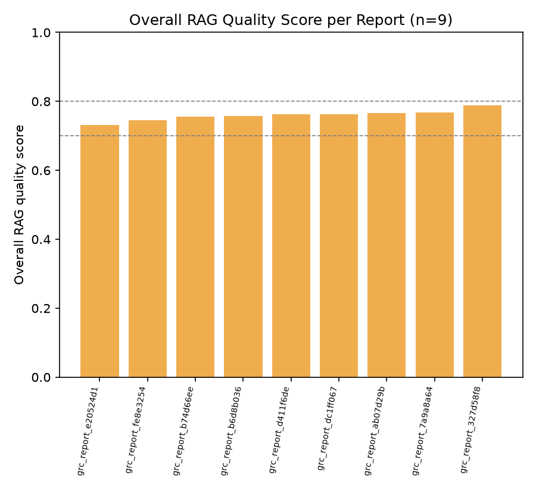
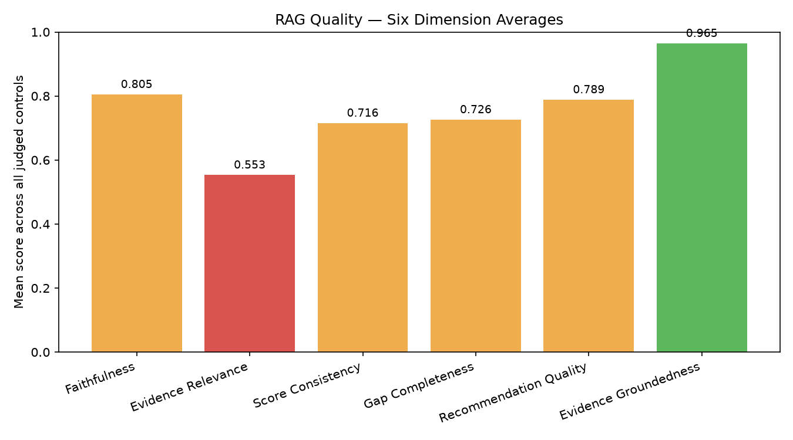
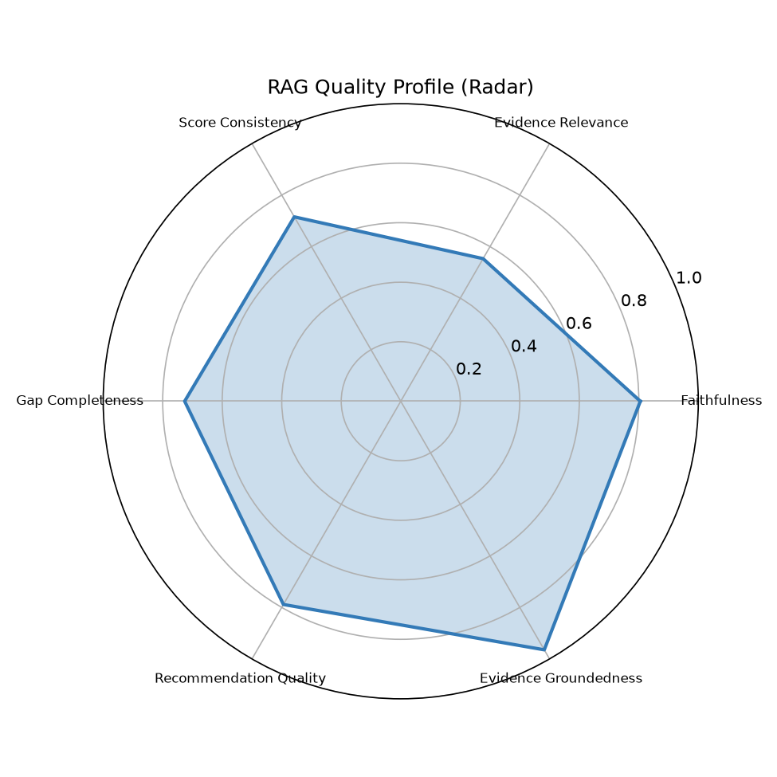
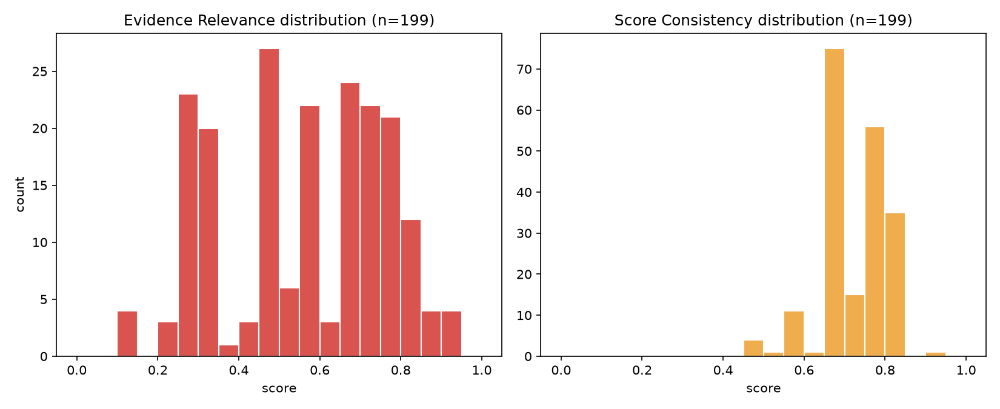
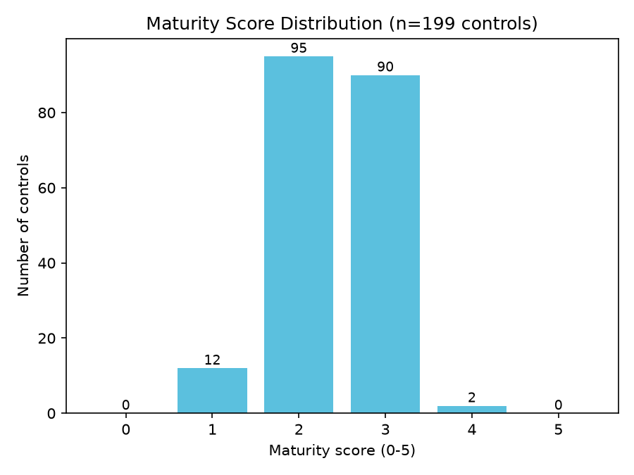

# RAG Quality Report

- Generated: 2026-07-14 01:30 UTC
- Source folder (scanned recursively): `/home/cyberschnell/Documents/GRC-LLM-2/DeptEduc_Llama_4_Mav_framework_reports`
- RAGAS eval reports found: **9**
- GRC assessment JSON files found: **9**
- Total controls judged (RAGAS): **199**
- Frameworks covered (eval reports): cis_csc, cmmc, csa_ccm, ftc_safeguards, hipaa, iso_27001, nist_800_53, nist_csf, pci_dss

## Overall RAG Quality Score per Report

| Report | Frameworks | Controls | Overall Score | Label |
|---|---|---|---|---|
| grc_report_e20524d1_rag_eval.txt | pci_dss | 23 | 0.731 | Acceptable |
| grc_report_fe8e3254_rag_eval.txt | hipaa | 20 | 0.745 | Acceptable |
| grc_report_b74d66ee_rag_eval.txt | cmmc | 20 | 0.756 | Acceptable |
| grc_report_b6d8b036_rag_eval.txt | iso_27001 | 24 | 0.757 | Acceptable |
| grc_report_d411f6de_rag_eval.txt | csa_ccm | 25 | 0.762 | Acceptable |
| grc_report_dc1ff067_rag_eval.txt | cis_csc | 18 | 0.763 | Acceptable |
| grc_report_ab07d29b_rag_eval.txt | nist_800_53 | 27 | 0.766 | Acceptable |
| grc_report_7a9a8a64_rag_eval.txt | nist_csf | 26 | 0.767 | Acceptable |
| grc_report_327d58f8_rag_eval.txt | ftc_safeguards | 16 | 0.789 | Acceptable |

**Aggregate overall score**: mean=0.760, median=0.762, min=0.731, max=0.789

## Six-Dimension Aggregate Stats (per-control, across all reports)

| Dimension | Mean | Median | Stdev | %<0.5 | %<0.7 | N |
|---|---|---|---|---|---|---|
| Faithfulness | 0.805 | 0.820 | 0.057 | 0.0% | 2.5% | 199 |
| Evidence Relevance | 0.553 | 0.550 | 0.199 | 40.7% | 67.8% | 199 |
| Score Consistency | 0.716 | 0.720 | 0.076 | 2.0% | 25.6% | 199 |
| Gap Completeness | 0.726 | 0.720 | 0.063 | 0.0% | 17.1% | 199 |
| Recommendation Quality | 0.789 | 0.800 | 0.047 | 0.0% | 4.0% | 199 |
| Evidence Groundedness | 0.965 | 1.000 | 0.119 | 1.0% | 5.5% | 199 |

## Worst-Scoring Example Controls per Dimension

**Faithfulness**
- `[0.62]` grc_report_b74d66ee_rag_eval.txt / AC.L2-3.1.12: The rationale reasonably reflects the limited evidence provided, but claims about 'monitoring by security operations' and 'secure protocols' are stretched interpretations of evidence quotes that reference general cyber incident response and public website protocols rather than remote access session monitoring specifically, creating some unsupported inference.
- `[0.62]` grc_report_d411f6de_rag_eval.txt / CEK-04: The rationale correctly notes the FIPS 140-2 reference but then claims the policy 'does not formally state' FIPS 140-2/3 alignment while evidence quote [1] explicitly cites 'FIPS PUB 140-2, Security Requirements for Cryptographic Modules,' creating a partial contradiction; the gap claiming 'no direct mandate for alignment with FIPS 140-2/3' is also undermined by evidence [1], making some gap statements unfaithful to the evidence.
- `[0.62]` grc_report_fe8e3254_rag_eval.txt / 164.308(a)(1): The first gap ('No explicit requirement for conducting risk assessments more frequently than every three years or after significant changes') is directly contradicted by Evidence [3], which explicitly states assessments occur 'at no less than every three years OR when significant changes occur'; the rationale and other gaps are otherwise reasonably grounded in what the evidence shows.

**Evidence Relevance** — weakest dimension, showing more examples
- `[0.15]` grc_report_b74d66ee_rag_eval.txt / IA.L2-3.5.7: The cited evidence quotes address general IT configuration guidance, PIV-based authentication, and broad security control performance assessment — none of which directly address password complexity, character change requirements, or automated password strength enforcement as required by this control.
- `[0.15]` grc_report_d411f6de_rag_eval.txt / BCR-03: The three evidence quotes address NIST control applicability, continuous security monitoring, and documentation updates, none of which directly address business continuity or disaster recovery testing procedures, making them largely tangential to BCR-03's specific requirements.
- `[0.15]` grc_report_dc1ff067_rag_eval.txt / CIS-9: The cited evidence quotes are generic policy structure and FISMA compliance statements with no meaningful relevance to email and web browser threat protections, making them essentially boilerplate that does not address the specific control requirement.
- `[0.15]` grc_report_e20524d1_rag_eval.txt / PCI-5.3: None of the four evidence quotes specifically address anti-malware mechanisms, update frequencies, or malware scanning — they cover generic continuous monitoring, patch management timelines, NIST control selection, and annual reviews, making them largely irrelevant to PCI-5.3's specific requirements.
- `[0.20]` grc_report_b6d8b036_rag_eval.txt / A.8.3: The four evidence quotes are broad governance and asset-management boilerplate that do not address removable media handling, classification-based media protection, or any media-specific control, making them only tangentially relevant to control A.8.3.
- `[0.20]` grc_report_d411f6de_rag_eval.txt / BCR-01: The three quotes address general information security policy maintenance, continuous security monitoring, and security documentation updates, none of which directly address business continuity management, disaster recovery, or BCM testing requirements specified by the control.
- `[0.20]` grc_report_dc1ff067_rag_eval.txt / CIS-18: None of the four cited evidence quotes directly address penetration testing or simulated attack scenarios; they reference general continuous monitoring, NIST framework compliance, and document management, making them largely generic boilerplate with no specific relevance to CIS-18's core requirement.
- `[0.25]` grc_report_7a9a8a64_rag_eval.txt / RC.IM-1: Neither quote directly addresses recovery plan improvement through lessons learned — quote [1] relates to weakness tracking in a repository and quote [2] relates to incident reporting procedures, both of which are only tangentially related to the specific control requirement of incorporating lessons learned into recovery plans.
- `[0.25]` grc_report_ab07d29b_rag_eval.txt / AC-17: None of the three evidence quotes directly address remote access — they cover general system configuration guidance, ATO authorization, and least-privilege access grants — making them only tangentially related to AC-17's specific requirements for remote access usage restrictions, connection requirements, and prior authorization of remote connections.
- `[0.25]` grc_report_ab07d29b_rag_eval.txt / IA-8: The three cited excerpts address PIV card issuance for government employees, procurement security clauses, and least-privilege access management — none of these directly addresses unique identification and authentication of non-organizational users, making them largely off-topic for IA-8's specific requirement.
- `[0.25]` grc_report_b6d8b036_rag_eval.txt / A.11.2: The cited quotes address general information protection principles, least-privilege access, personnel security duties, and PII controls — none of which directly speak to the control's specific requirement of physically siting and protecting equipment against environmental threats and unauthorized physical access.
- `[0.25]` grc_report_b74d66ee_rag_eval.txt / AC.L2-3.1.12: None of the three evidence quotes directly address remote access session monitoring or control: Quote 1 is about a cybersecurity operations center for cyber incidents, Quote 2 is about public-facing federal website protocols, and Quote 3 references PIV authentication, which is tangentially related but not specific to remote access session cryptographic protections.

**Score Consistency**
- `[0.45]` grc_report_ab07d29b_rag_eval.txt / SI-3: A score of 2 is marginally inflated given that no evidence quote explicitly addresses any element of SI-3 (malicious code protection at entry/exit points, automated updates, centralized management); the evidence is so generic that a score of 1 would be more defensible.
- `[0.45]` grc_report_d411f6de_rag_eval.txt / AIS-01: A score of 3 (defined/managed) is inflated given that the evidence quotes do not directly demonstrate application security policy documentation, approval, communication, or evaluation processes—the evidence is largely about system authorization and procurement, which would more accurately support a score of 1–2.
- `[0.45]` grc_report_e20524d1_rag_eval.txt / PCI-5.3: A score of 2 is somewhat inflated given that no evidence quote directly addresses anti-malware installation, updates, scanning, or monitoring; the generic governance references provide only very weak indirect coverage, suggesting a score of 1 would be more appropriate.

**Gap Completeness**
- `[0.50]` grc_report_fe8e3254_rag_eval.txt / 164.308(a)(1): The first gap is factually wrong (contradicted by Evidence [3] which includes 'significant changes' trigger), and the assessment misses obvious control requirements such as explicit procedures for incident containment and correction of security violations, and no mention of ePHI-specific risk analysis coverage.
- `[0.55]` grc_report_ab07d29b_rag_eval.txt / SI-2: The gap about configuration management integration is partially contradicted by evidence [5], and the assessment misses an obvious gap: no explicit mention of a formal process for identifying and reporting flaws (the 'identifies and reports' component of SI-2 beyond the POA&M entry step).
- `[0.55]` grc_report_b6d8b036_rag_eval.txt / A.8.1: The third gap claiming no integration between asset inventories and risk management is directly contradicted by Evidence [3], which explicitly describes a continuous monitoring strategy for ongoing visibility into cybersecurity risk posture; additionally, the gaps miss obvious control requirements such as asset ownership assignment and the scope of asset types to be inventoried.

**Recommendation Quality**
- `[0.60]` grc_report_fe8e3254_rag_eval.txt / 164.308(a)(1): Recommendations like annual risk assessments and defining security metrics are actionable and tied to identified gaps, but the first recommendation is undermined by the false gap it addresses, and none of the recommendations specifically address ePHI protection, containment, or correction procedures as required by the control.
- `[0.65]` grc_report_d411f6de_rag_eval.txt / CEK-04: The recommendations are reasonably actionable and address most identified gaps, but they remain somewhat generic (e.g., 'define monitoring and metrics') without specifying which algorithms to mandate, referencing NIST SP 800-175B or concrete algorithm selection criteria, or distinguishing between data-at-rest versus data-in-transit controls.
- `[0.65]` grc_report_e20524d1_rag_eval.txt / PCI-7.1: The recommendations are reasonably actionable and address the stated gaps around continuous monitoring and risk-based triggers, but they are somewhat generic (e.g., 'leverage collected metrics and incident lessons learned') and fail to address the more fundamental PCI-7.1 gaps around ensuring processes are defined, documented, and understood across the organization, limiting their practical specificity.

**Evidence Groundedness**
- `[0.00]` grc_report_e20524d1_rag_eval.txt / PCI-12.3: 0/2 quotes located in PDF  [WARNING: possible hallucinated citations]
- `[0.40]` grc_report_b6d8b036_rag_eval.txt / A.6.1: 2/5 quotes located in PDF  [WARNING: possible hallucinated citations]
- `[0.50]` grc_report_e20524d1_rag_eval.txt / PCI-1.1: 2/4 quotes located in PDF  [WARNING: possible hallucinated citations]

## Maturity Score Distribution (from GRC assessment JSONs)

Total controls: 199, mean maturity: 2.41 / 5

| Maturity | Count | % |
|---|---|---|
| 0 | 0 | 0.0% |
| 1 | 12 | 6.0% |
| 2 | 95 | 47.7% |
| 3 | 90 | 45.2% |
| 4 | 2 | 1.0% |
| 5 | 0 | 0.0% |

## Charts

## LLM Expert Analysis

# Expert RAG/GRC Quality Analysis

## 1. Overall RAG Quality Verdict

The system delivers **moderate-to-acceptable overall quality** (mean 0.760, range 0.731–0.789 across nine reports), with notably low variance between documents — a tight inter-report spread of only 0.058 points suggests systematic, architecture-level strengths and weaknesses rather than document-specific anomalies. The score is serviceable for a first-generation compliance assessment tool but falls materially short of production-grade GRC reliability, primarily because the retrieval pipeline is demonstrably broken for a substantial proportion of controls.

## 2. Strongest and Weakest Dimensions

**Strongest — Evidence Groundedness (mean 0.965, median 1.000):** The vast majority of cited quotes are verifiably locatable in source PDFs. This is reassuring: hallucinated fabrication of evidence text is rare (only 1.0% of controls score below 0.5). The three flagged exceptions (PCI-12.3 at 0.00, A.6.1 at 0.40, PCI-1.1 at 0.50) are serious individual incidents but not systemic.

**Second-strongest — Faithfulness (mean 0.805) and Recommendation Quality (mean 0.789):** Generation quality is genuinely reasonable. The LLM is largely faithful to what the retrieved evidence says, and recommendations are generally actionable. Worst faithfulness scores (0.62) reflect inferential overreach — the model stretches plausible-but-unsupported conclusions — rather than outright confabulation. This points to a **prompting/instruction issue** (insufficient citation-anchoring constraints), not a fundamental generation failure.

**Weakest by a wide margin — Evidence Relevance (mean 0.553, median 0.550, stdev 0.199):** This is the system's critical failure point. Fully **40.7% of controls score below 0.50** and **67.8% below 0.70** on this dimension. The worst examples (scores of 0.15) show the retrieval layer returning generic governance boilerplate — FISMA compliance statements, continuous monitoring platitudes, broad policy language — against highly specific controls such as password complexity rules (IA.L2-3.5.7), business continuity testing (BCR-03), anti-malware scanning (PCI-5.3), and penetration testing (CIS-18). This is unambiguously a **retrieval failure**: the embedding or keyword matching strategy is unable to discriminate topic-specific chunks from superficially similar policy text. The high stdev (0.199) confirms this is not uniformly bad — some controls retrieve well — suggesting inconsistent chunking quality or embedding space collisions around generic policy language.

**Score Consistency (mean 0.716, 25.6% below 0.70)** is the secondary weakness and is causally downstream of the retrieval problem: when retrieved evidence is irrelevant, maturity scores assigned against that evidence are logically unreliable, producing the inflation seen in examples like AIS-01 (scored 3) and PCI-5.3 (scored 2) despite evidence that addresses neither control.

## 3. Maturity Score Calibration

The distribution (mean 2.41; 0:0, 1:12, 2:95, 3:90, 4:2, 5:0) exhibits classic **centrality bias with upward inflation**. The near-total absence of scores at 0 and 5 is expected, but the concentration of 95+90=185 controls (93%) in bands 2–3, with only 14 controls outside that range, is suspicious. Given that Evidence Relevance is below 0.50 for ~41% of controls, a well-calibrated system should be assigning more 1s (insufficient evidence to demonstrate maturity) rather than defaulting to 2. The three Score Consistency outliers (all rated as inflated by the RAGAS judge) confirm the pattern: the generation layer is awarding partial-credit scores even when the evidence is substantively irrelevant. This constitutes **systematic score inflation** that would mislead compliance stakeholders into believing moderate maturity is demonstrated when the underlying evidence simply does not support the assessment.

## 4. Prioritized Recommendations

**Priority 1 — Overhaul the retrieval pipeline (addresses Evidence Relevance, root cause of most failures).**
Implement control-aware retrieval: use the specific control identifier, its canonical description, and domain keywords as structured query components rather than relying on semantic similarity alone. Consider hybrid retrieval (BM25 + dense embeddings) with re-ranking calibrated on GRC corpora. Given that 67.8% of controls score below 0.70 on relevance, this is the highest-leverage intervention available.

**Priority 2 — Add retrieval quality gating before generation.**
Before passing chunks to the LLM, score retrieved evidence against a minimum relevance threshold (e.g., discard chunks below cosine similarity 0.6 or equivalent). If no qualifying evidence exists, the system should explicitly flag the control as "insufficient evidence — cannot assess" rather than proceeding to generate a maturity score. This directly addresses score inflation for the ~41% of controls with sub-0.50 evidence relevance.

**Priority 3 — Tighten faithfulness constraints in generation prompts.**
Add explicit instructions requiring the model to cite specific evidence quote numbers for every factual claim in the rationale and gaps, and to flag any claim not supportable by a direct quote. The 0.62 faithfulness cases demonstrate inferential leap without clear instruction prohibition. This is a low-cost, high-impact prompt engineering change.

**Priority 4 — Introduce a maturity score floor rule tied to evidence relevance.**
Implement a post-processing rule: if computed Evidence Relevance is below 0.40 (approximately the bottom quartile of the current distribution), cap the assigned maturity score at 1 regardless of generation output. This would immediately correct cases like SI-3 and AIS-01 where the model awarded 2–3 against irrelevant evidence.

**Priority 5 — Audit and remediate the three hallucinated-citation controls.**
PCI-12.3 (0/2 quotes found), A.6.1 (2/5), and PCI-1.1 (2/4) require manual review and reprocessing. Establish a recurring automated groundedness check (fuzzy string match against source PDFs) as a production quality gate, with any control below 0.50 flagged for human review before report delivery.
