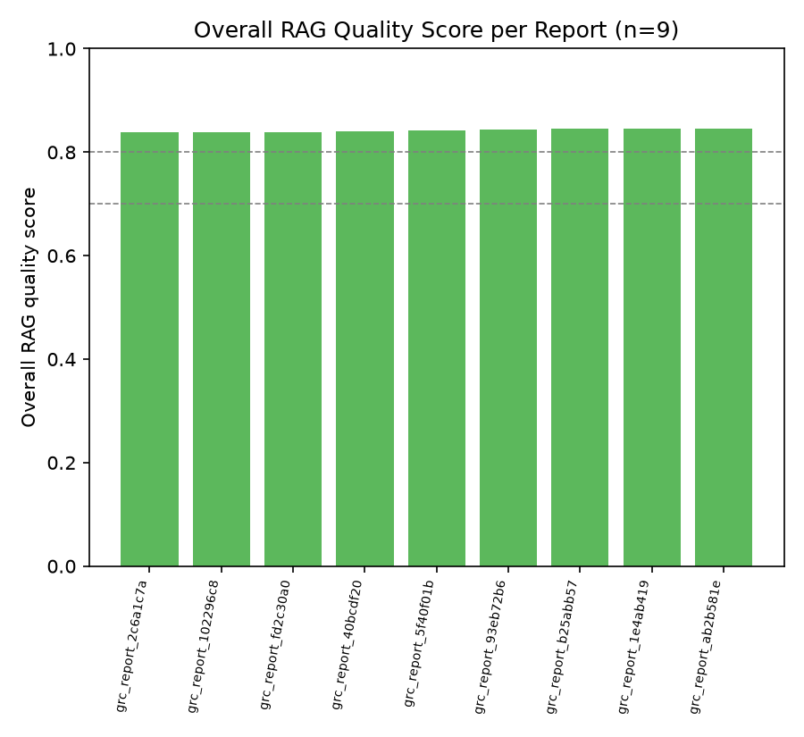
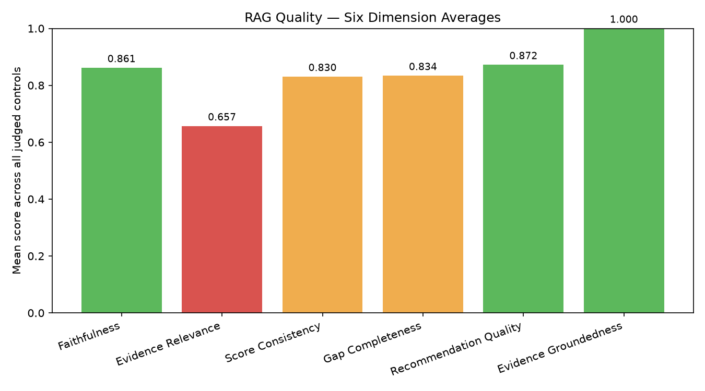
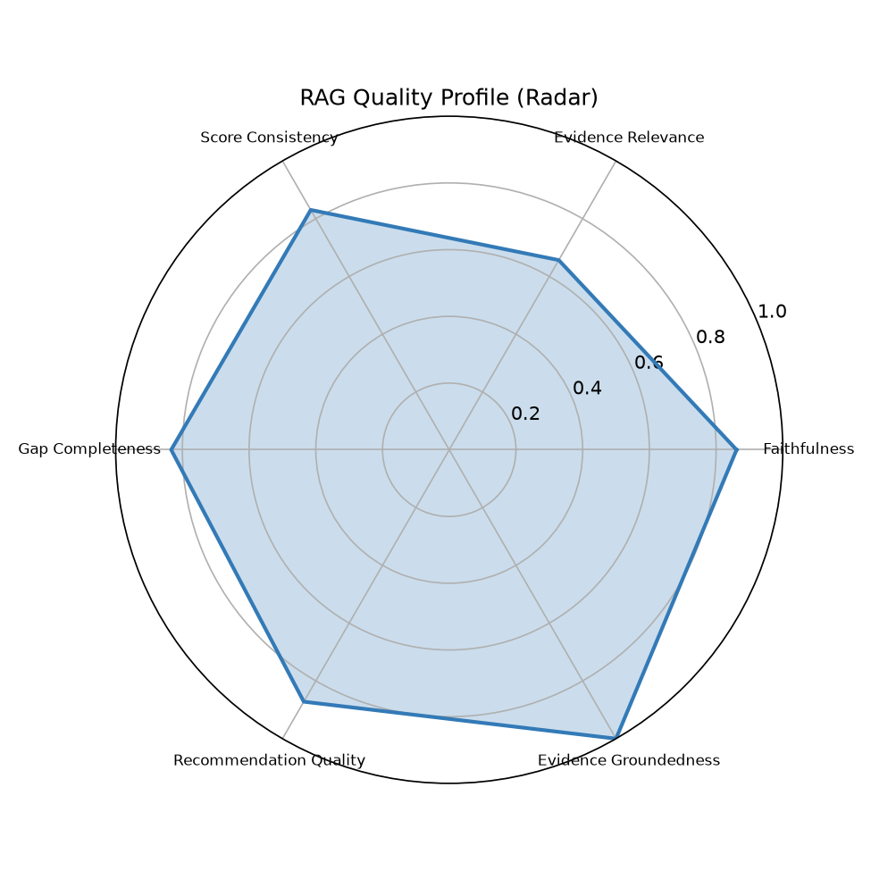
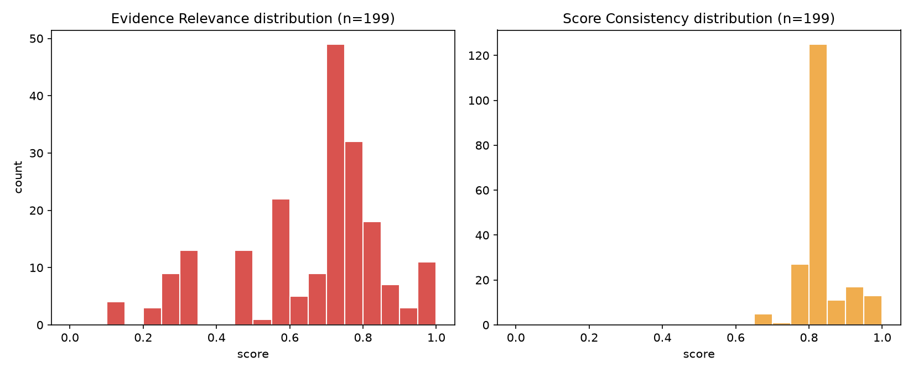
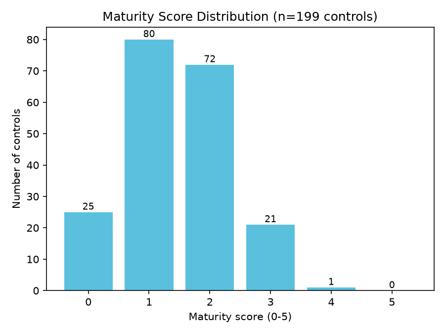

# RAG Quality Report

- Generated: 2026-07-14 01:36 UTC
- Source folder (scanned recursively): `/home/cyberschnell/Documents/GRC-LLM-2/Scott&Scott_Anthrop_framework_reports`
- RAGAS eval reports found: **9**
- GRC assessment JSON files found: **9**
- Total controls judged (RAGAS): **199**
- Frameworks covered (eval reports): cis_csc, cmmc, csa_ccm, ftc_safeguards, hipaa, iso_27001, nist_800_53, nist_csf, pci_dss

## Overall RAG Quality Score per Report

| Report | Frameworks | Controls | Overall Score | Label |
|---|---|---|---|---|
| grc_report_2c6a1c7a_rag_eval.txt | iso_27001 | 24 | 0.838 | Good |
| grc_report_102296c8_rag_eval.txt | cmmc | 20 | 0.839 | Good |
| grc_report_fd2c30a0_rag_eval.txt | pci_dss | 23 | 0.839 | Good |
| grc_report_40bcdf20_rag_eval.txt | nist_800_53 | 27 | 0.841 | Good |
| grc_report_5f40f01b_rag_eval.txt | ftc_safeguards | 16 | 0.842 | Good |
| grc_report_93eb72b6_rag_eval.txt | csa_ccm | 25 | 0.844 | Good |
| grc_report_b25abb57_rag_eval.txt | cis_csc | 18 | 0.845 | Good |
| grc_report_1e4ab419_rag_eval.txt | nist_csf | 26 | 0.846 | Good |
| grc_report_ab2b581e_rag_eval.txt | hipaa | 20 | 0.846 | Good |

**Aggregate overall score**: mean=0.842, median=0.842, min=0.838, max=0.846

## Six-Dimension Aggregate Stats (per-control, across all reports)

| Dimension | Mean | Median | Stdev | %<0.5 | %<0.7 | N |
|---|---|---|---|---|---|---|
| Faithfulness | 0.861 | 0.850 | 0.064 | 0.0% | 0.0% | 199 |
| Evidence Relevance | 0.657 | 0.720 | 0.202 | 21.1% | 39.7% | 199 |
| Score Consistency | 0.830 | 0.800 | 0.062 | 0.0% | 0.0% | 199 |
| Gap Completeness | 0.834 | 0.850 | 0.060 | 0.0% | 1.5% | 199 |
| Recommendation Quality | 0.872 | 0.880 | 0.031 | 0.0% | 0.0% | 199 |
| Evidence Groundedness | 1.000 | 1.000 | 0.000 | 0.0% | 0.0% | 199 |

## Worst-Scoring Example Controls per Dimension

**Faithfulness**
- `[0.72]` grc_report_1e4ab419_rag_eval.txt / ID.AM-1: Most rationale claims are supported by the evidence, but the gap asserting movement tracking is 'optional (may be implemented)' is not directly supported by any of the three quoted evidence passages, which appear to state these controls as requirements rather than optional measures.
- `[0.72]` grc_report_1e4ab419_rag_eval.txt / ID.GV-1: Most rationale claims are supported by evidence, but the gap asserting 'appropriate sanctions are mentioned' is not supported by any of the six cited evidence quotes, indicating the rationale references content outside the provided evidence.
- `[0.72]` grc_report_1e4ab419_rag_eval.txt / PR.DS-1: The rationale correctly identifies that encryption is referenced but not mandated, and evidence [1] does support this as a 'mechanism' rather than a requirement; however, the gap claiming encryption is explicitly framed as 'may be implemented' is not directly supported by the quoted evidence, which merely lists it as a mechanism without that specific permissive language.

**Evidence Relevance** — weakest dimension, showing more examples
- `[0.15]` grc_report_2c6a1c7a_rag_eval.txt / A.15.1: Neither evidence quote directly addresses supplier relationships, supplier access controls, or documented security requirements with third parties — Evidence [1] is a generic internal risk statement and Evidence [2] is about an internal coordinator role, making both largely irrelevant to control A.15.1's specific requirements.
- `[0.15]` grc_report_93eb72b6_rag_eval.txt / CCC-01: The four evidence quotes address physical security alterations, facility repairs, access control, and annual program review — none directly address change management for applications, systems, infrastructure, or configurations, making them largely irrelevant to the control requirement.
- `[0.15]` grc_report_b25abb57_rag_eval.txt / CIS-16: The sole evidence quote references only restricting software installs to reduce risk from viruses/trojans, which is tangentially related to application security at best and does not address the secure software lifecycle management requirement of the control.
- `[0.15]` grc_report_fd2c30a0_rag_eval.txt / PCI-1.3: Neither evidence quote addresses CDE-specific network access controls, DMZ architecture, or prohibition of direct public internet access to cardholder data systems — they cover generic remote access authentication and acceptable use policy, making them largely irrelevant to PCI-1.3.
- `[0.20]` grc_report_40bcdf20_rag_eval.txt / SI-2: The three evidence quotes are largely generic policy boilerplate about security violations, development problems, and system failures — none directly address flaw remediation processes, patch management, or software update testing as required by SI-2, making them minimally relevant to the specific control.
- `[0.20]` grc_report_93eb72b6_rag_eval.txt / AIS-02: Both quotes are generic risk and information-systems boilerplate with no direct relevance to application security baselines, OWASP, secure coding, or application categories, making them largely unhelpful for assessing this specific control.
- `[0.20]` grc_report_fd2c30a0_rag_eval.txt / PCI-3.1: The three quotes are generic information security program boilerplate covering broad PII and electronic information protection, with no specific relevance to cardholder data retention, data minimization, or PCI DSS stored account data requirements.
- `[0.25]` grc_report_102296c8_rag_eval.txt / SC.L2-3.13.10: The two quoted excerpts reference encryption in a generic sense but address neither cryptographic key management nor any element of the key lifecycle, making them tangentially related to the control at best and insufficient to directly support assessment of SC.L2-3.13.10.
- `[0.25]` grc_report_102296c8_rag_eval.txt / SI.L1-3.14.1: The cited evidence quotes are largely definitional/taxonomic risk categories (system failures, development problems) from a risk assessment context and a generic malware detection reference, none of which directly address the control's specific requirements of identifying, reporting, correcting flaws, or testing updates for effectiveness.
- `[0.25]` grc_report_1e4ab419_rag_eval.txt / ID.AM-2: None of the three cited evidence quotes directly address software platform or application inventory or lifecycle management; they relate to physical/logical access control and contingency planning criticality assessments, making them largely irrelevant to the ID.AM-2 control requirement.
- `[0.25]` grc_report_1e4ab419_rag_eval.txt / DE.AE-1: The three quotes address general network monitoring prohibitions, generic security safeguards, and malware/login procedures, none of which directly address establishing or managing a baseline of network operations and expected data flows as required by DE.AE-1.
- `[0.25]` grc_report_40bcdf20_rag_eval.txt / CM-2: The two cited quotes are only tangentially related to baseline configuration management — patch management and access-restricted installation caution are adjacent concerns but do not address developing, documenting, or maintaining baseline configurations under configuration control as CM-2 requires.

**Score Consistency**
- `[0.70]` grc_report_2c6a1c7a_rag_eval.txt / A.5.1: A score of 2 is reasonably consistent with the evidence showing a formal policy exists with an effective date and employee compliance requirement, but lacking explicit communication mechanisms, a policy framework, and documented review cycles; however, a score of 2 may be slightly conservative given that a formal written policy with management approval and compliance requirements does represent meaningful foundational work.
- `[0.70]` grc_report_5f40f01b_rag_eval.txt / FTC-3.7: A score of 2 is reasonably consistent with the weak and indirect evidence provided — the policy shows some awareness of system-related risks but lacks any dedicated change management process — though a score of 1 might be more defensible given how tangential the evidence is to the specific control requirement.
- `[0.70]` grc_report_93eb72b6_rag_eval.txt / IAM-01: A score of 2 is defensible given that multiple core control elements (least-privilege, formal approval, communication plan, evaluation cycle) are unaddressed, though the evidence does show foundational IAM procedures exist, which could arguably support a 3; the score is slightly conservative but not unreasonable.

**Gap Completeness**
- `[0.65]` grc_report_1e4ab419_rag_eval.txt / ID.GV-1: The gaps capture meaningful deficiencies around communication mechanisms, policy structure, and roles, but the sanctions-related gap references content not present in the evidence quotes, and the gaps miss an obvious requirement — whether the policy explicitly covers all cybersecurity domains required by the control or whether there is evidence of periodic updates communicated to staff.
- `[0.65]` grc_report_fd2c30a0_rag_eval.txt / PCI-7.2: The gaps correctly identify missing RBAC formalization, ACL specificity, approval workflows, and default-deny requirements, but the gap about 'optional language qualifiers' is unsupported by evidence, and there is no mention of the missing requirement to cover all system components in scope (cardholder data environment scope definition), which is a key PCI-7.2 element.
- `[0.68]` grc_report_ab2b581e_rag_eval.txt / 164.310(d)(1): The gaps capture several legitimate omissions (roles, sanitization standards, audit mechanisms, portable media), but the claim that tracking is 'optional rather than required' is unsupported by the evidence quotes and may be fabricated, while the ePHI terminology gap is a valid observation; overall the gaps are reasonably comprehensive but include at least one unverified assertion.

**Recommendation Quality**
- `[0.78]` grc_report_fd2c30a0_rag_eval.txt / PCI-1.2: Recommendations are specific and directly address the identified gaps (default-deny policy, ruleset documentation, periodic review cadence, segmentation requirements, and change management), though the six-month review cycle specified is actionable but not fully justified relative to PCI DSS expectations, and the final point on metrics is slightly generic.
- `[0.80]` grc_report_1e4ab419_rag_eval.txt / ID.AM-1: Recommendations are specific, actionable, and well-aligned to the identified gaps (formal policy, automated discovery tools, defined attributes, periodic audits, risk integration), though the suggestion to integrate with risk management processes is somewhat generic and not directly tied to a specific identified gap.
- `[0.80]` grc_report_2c6a1c7a_rag_eval.txt / A.12.1: Recommendations are specific, actionable, and directly tied to each identified gap (e.g., centralized repository for accessibility gap, defined review cycles for the procedure update gap, rollback procedures for change management gap), with only the separation-of-environments and capacity planning items being slightly beyond the control's core scope.

**Evidence Groundedness**
- `[1.00]` grc_report_102296c8_rag_eval.txt / AC.L1-3.1.1: 7/7 quotes located in PDF
- `[1.00]` grc_report_102296c8_rag_eval.txt / AC.L2-3.1.3: 4/4 quotes located in PDF
- `[1.00]` grc_report_102296c8_rag_eval.txt / AC.L2-3.1.5: 4/4 quotes located in PDF

## Maturity Score Distribution (from GRC assessment JSONs)

Total controls: 199, mean maturity: 1.46 / 5

| Maturity | Count | % |
|---|---|---|
| 0 | 25 | 12.6% |
| 1 | 80 | 40.2% |
| 2 | 72 | 36.2% |
| 3 | 21 | 10.6% |
| 4 | 1 | 0.5% |
| 5 | 0 | 0.0% |

## Charts

## LLM Expert Analysis

# Expert RAG/GRC Quality Analysis

## 1. Overall RAG Quality Verdict

The system achieves a mean overall score of **0.842** (range 0.838–0.846, remarkably tight across 9 reports), indicating solid baseline performance. However, this aggregate masks a critical structural weakness: **Evidence Relevance at 0.657 mean is dragging quality down system-wide**, and the near-perfect Evidence Groundedness (1.000) inflates the composite score significantly. The true generative and retrieval quality is more accurately characterized as **moderate**, not high. The system is reliable in what it *does* with evidence it has, but frequently retrieves the wrong evidence in the first place.

---

## 2. Strongest and Weakest Dimensions

**Strongest: Evidence Groundedness (1.000/1.000, σ=0.000)**
Every cited quote was verifiably located in the source PDFs. This is a strong anti-hallucination result for direct citation integrity, but it is a necessary-not-sufficient condition — the system proves it can quote real text, not that it retrieves *relevant* text.

**Second-strongest tier: Recommendation Quality (0.872), Gap Completeness (0.834), Score Consistency (0.830), Faithfulness (0.861)** — all perform well, with low sub-0.7 rates (0–1.5%). The generation/prompting layer is functioning well: given whatever evidence is retrieved, the LLM constructs coherent, actionable recommendations and identifies genuine gaps.

**Weakest by far: Evidence Relevance (mean=0.657, median=0.720, σ=0.202)**
- **21.1% of controls score below 0.5** — one in five assessments is built on substantially irrelevant evidence
- **39.7% score below 0.7** — nearly two in five have materially inadequate retrieval
- Worst cases score as low as **0.15** (A.15.1, CCC-01, CIS-16, PCI-1.3), where retrieved passages bear almost no semantic relationship to the control being assessed

This pattern is unambiguous: **the system's primary failure mode is retrieval quality, not generation quality.** Controls like CCC-01 (change management) retrieved physical security passages; PCI-1.3 (CDE network segmentation) retrieved generic remote access boilerplate; SC.L2-3.13.10 (key management) retrieved generic encryption mentions. This is a **semantic retrieval gap** — the embedding or chunking strategy fails to distinguish topically adjacent but substantively different policy domains.

**Secondary concern: Faithfulness (worst cases at 0.72)** — a pattern of rationale claims referencing content *not present* in retrieved evidence (e.g., sanctions language in ID.GV-1, optional framing in ID.AM-1). This is low-grade hallucination in the analytical layer, appearing to affect primarily the `grc_report_1e4ab419` document cluster. At 0% below 0.7 overall this is not systemic, but warrants monitoring.

---

## 3. Maturity Score Calibration

The distribution (mean=**1.46**, counts: 0:25, 1:80, 2:72, 3:21, 4:1, 5:0) is **broadly plausible for an SME/mid-market compliance posture** and avoids obvious score inflation at the high end — no 5s, only one 4, and 52% of scores at 0–1 suggest genuine conservatism. However, there is a **calibration concern at the low-to-mid boundary**: with 39.7% of Evidence Relevance scores below 0.7, a meaningful fraction of maturity scores of 1 or 2 are being derived from near-irrelevant evidence. The scores may be *accidentally correct* (conservative scoring compensates for retrieval failure) or *systematically understated* (correct controls appear weak because the retrieved text doesn't capture real implementation evidence). The tight overall score range (0.838–0.846 across all 9 reports) also suggests the scoring rubric may be insufficiently sensitive to per-control evidence quality variation — a well-calibrated system should show more variance across heterogeneous policy documents.

---

## 4. Prioritized Recommendations

**Priority 1 — Fix retrieval (highest impact)**
The 39.7% sub-0.7 Evidence Relevance rate is the dominant quality risk. Implement control-specific retrieval: map each control ID to a curated keyword/concept taxonomy and use hybrid retrieval (BM25 + dense embeddings) with re-ranking. For domain-specific controls (PCI DSS, CMMC, CSA CCM), augment chunk metadata with framework tags to prevent cross-domain retrieval contamination. Target: reduce pct<0.5 from 21.1% to under 5%.

**Priority 2 — Add retrieval confidence gating**
When top-k retrieved chunks score below a relevance threshold (e.g., cosine similarity < 0.65), the system should flag the control as "insufficient evidence" rather than proceeding to assessment. This prevents the 0.15-scored assessments (A.15.1, CCC-01, PCI-1.3) from producing false-confidence maturity scores.

**Priority 3 — Audit the `grc_report_1e4ab419` document cluster**
Three of the four worst Faithfulness examples and two of the worst Gap Completeness examples originate from this single report. The source policy document may have atypical structure (e.g., dense combined policies, non-standard section labeling) that disrupts both retrieval and rationale generation. Apply document-specific chunking or preprocessing.

**Priority 4 — Introduce evidence sufficiency checks in prompting**
Add an explicit generation instruction: *"If the cited evidence does not directly address the control requirement, state 'insufficient evidence' rather than inferring from adjacent content."* This addresses the faithfulness failures where the LLM introduces claims (sanctions language, optional framing) unsupported by retrieved text.

**Priority 5 — Widen maturity score sensitivity**
The near-identical aggregate scores across 9 reports (0.838–0.846 range) suggests report-level normalization may be occurring. Audit whether maturity scores for controls assessed on low-relevance evidence systematically differ from those with high-relevance evidence — if not, the scoring is not sufficiently conditioned on evidence quality.
