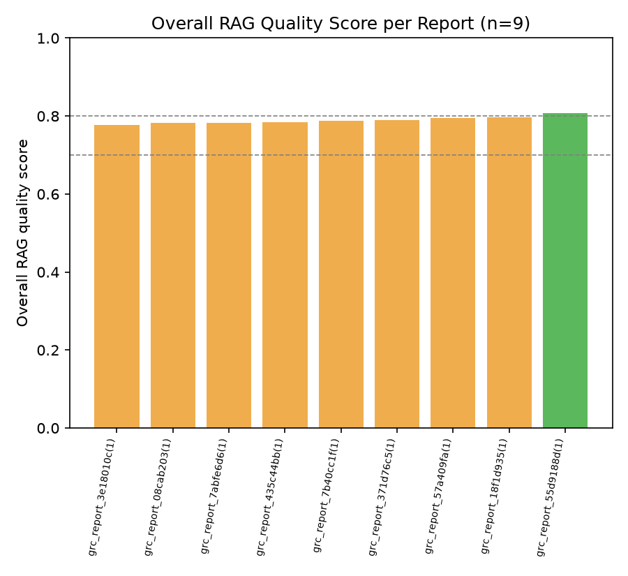
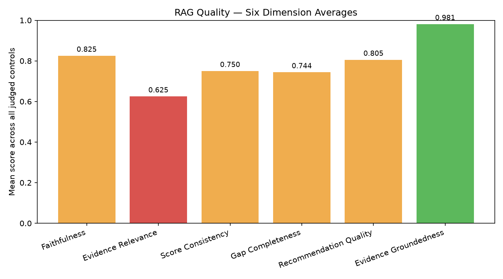
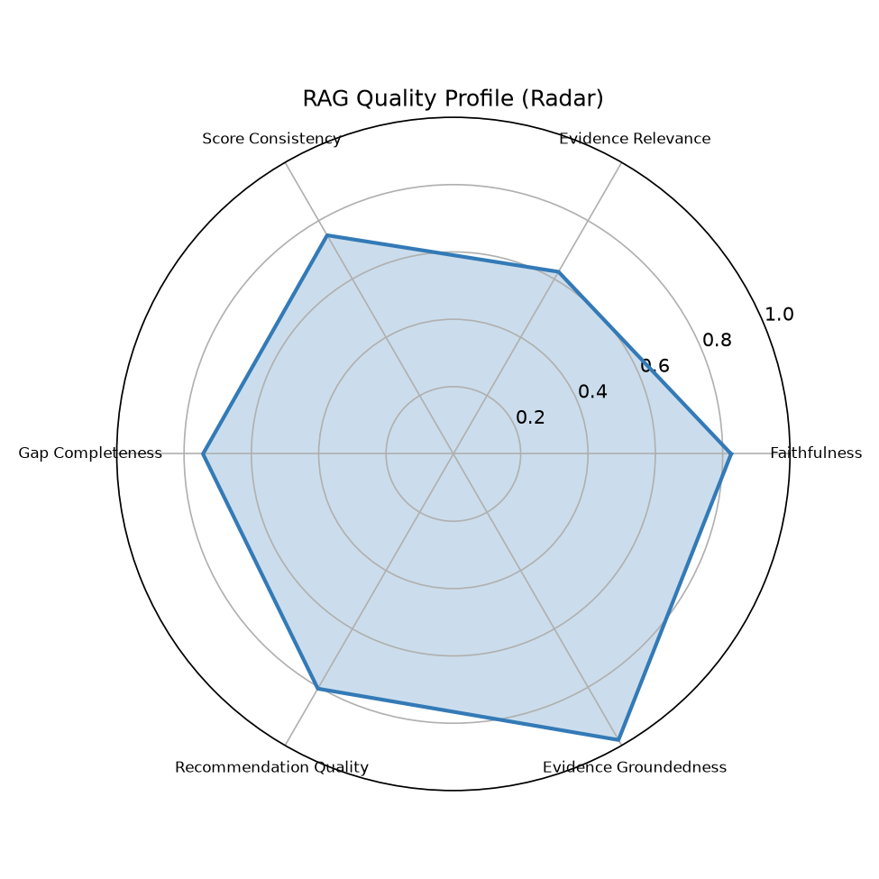
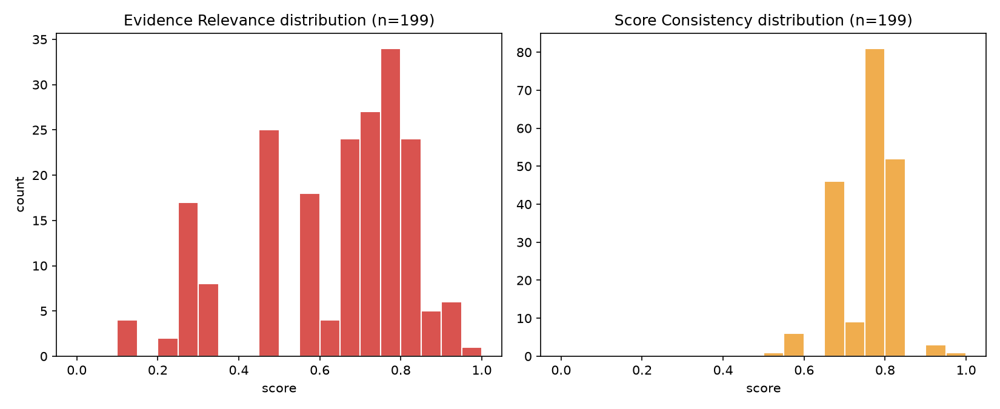
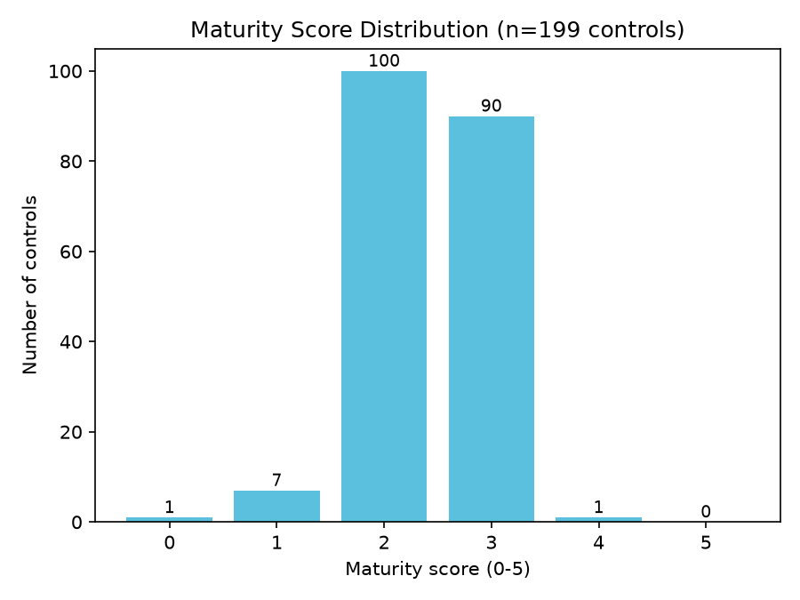

# RAG Quality Report

- Generated: 2026-07-14 01:32 UTC
- Source folder (scanned recursively): `/home/cyberschnell/Documents/GRC-LLM-2/Scott&Scott_GPT_4.1_framework_reports`
- RAGAS eval reports found: **9**
- GRC assessment JSON files found: **9**
- Total controls judged (RAGAS): **199**
- Frameworks covered (eval reports): cis_csc, cmmc, csa_ccm, ftc_safeguards, hipaa, iso_27001, nist_800_53, nist_csf, pci_dss

## Overall RAG Quality Score per Report

| Report | Frameworks | Controls | Overall Score | Label |
|---|---|---|---|---|
| grc_report_3e18010c(1)_rag_eval.txt | cmmc | 20 | 0.777 | Acceptable |
| grc_report_08cab203(1)_rag_eval.txt | pci_dss | 23 | 0.782 | Acceptable |
| grc_report_7abfe6d6(1)_rag_eval.txt | nist_csf | 26 | 0.782 | Acceptable |
| grc_report_435c44bb(1)_rag_eval.txt | nist_800_53 | 27 | 0.785 | Acceptable |
| grc_report_7b40cc1f(1)_rag_eval.txt | iso_27001 | 24 | 0.788 | Acceptable |
| grc_report_371d76c5(1)_rag_eval.txt | hipaa | 20 | 0.790 | Acceptable |
| grc_report_57a409fa(1)_rag_eval.txt | cis_csc | 18 | 0.795 | Acceptable |
| grc_report_18f1d935(1)_rag_eval.txt | csa_ccm | 25 | 0.796 | Acceptable |
| grc_report_55d9188d(1)_rag_eval.txt | ftc_safeguards | 16 | 0.807 | Good |

**Aggregate overall score**: mean=0.789, median=0.788, min=0.777, max=0.807

## Six-Dimension Aggregate Stats (per-control, across all reports)

| Dimension | Mean | Median | Stdev | %<0.5 | %<0.7 | N |
|---|---|---|---|---|---|---|
| Faithfulness | 0.825 | 0.820 | 0.060 | 0.0% | 1.5% | 199 |
| Evidence Relevance | 0.625 | 0.650 | 0.200 | 28.1% | 50.8% | 199 |
| Score Consistency | 0.750 | 0.750 | 0.063 | 0.0% | 9.0% | 199 |
| Gap Completeness | 0.744 | 0.750 | 0.073 | 0.5% | 15.1% | 199 |
| Recommendation Quality | 0.805 | 0.800 | 0.050 | 0.0% | 2.5% | 199 |
| Evidence Groundedness | 0.981 | 1.000 | 0.071 | 0.0% | 3.0% | 199 |

## Worst-Scoring Example Controls per Dimension

**Faithfulness**
- `[0.62]` grc_report_371d76c5(1)_rag_eval.txt / 164.310(d)(1): The rationale's core claims are supported by the evidence, but the gaps assert absences (e.g., no accountability, no training, no monitoring) that are not directly contradicted or confirmed by the evidence quotes, and the claim that procedures 'lack detail regarding measurement, monitoring, and accountability' goes beyond what the quoted evidence can substantiate—evidence [4] does reference a record of movements and responsible persons, which partially addresses accountability.
- `[0.62]` grc_report_3e18010c(1)_rag_eval.txt / SI.L1-3.14.2: Evidence quote [5] explicitly states 'regularly monitor the effectiveness of such safeguards,' which directly contradicts the first gap claiming 'no explicit mention of monitoring or measurement of the effectiveness of malicious code protection controls,' undermining the faithfulness of the rationale and gaps.
- `[0.62]` grc_report_435c44bb(1)_rag_eval.txt / AC-1: The rationale's claim that purpose, scope, roles, and responsibilities are addressed is partially supported, but evidence quotes [1]-[6] do not explicitly demonstrate 'scope' or 'roles/responsibilities' as discrete policy elements; meanwhile, the gap claiming 'lacks accountability structures or assignment of responsibility' is contradicted by quote [4] which references supervision and authorization responsibilities for employees working with electronic information.

**Evidence Relevance** — weakest dimension, showing more examples
- `[0.10]` grc_report_435c44bb(1)_rag_eval.txt / CM-8: Neither evidence quote addresses information system component inventory in any meaningful way — quote [1] concerns audit controls and quote [2] concerns risk identification — making both essentially off-topic for CM-8's specific requirement.
- `[0.15]` grc_report_08cab203(1)_rag_eval.txt / PCI-10.6: The three quoted excerpts address generic audit controls, integrity policies, and log review procedures — none of them mention time synchronization, NTP, consistent time sources, or protection of time data, making them only peripherally related to PCI-10.6's specific requirements.
- `[0.15]` grc_report_18f1d935(1)_rag_eval.txt / GRC-05: All three evidence quotes relate to access authorization and employee supervision controls, which are generic information security procedures with no meaningful connection to intellectual property rights protection or software licensing requirements.
- `[0.15]` grc_report_55d9188d(1)_rag_eval.txt / FTC-5: All three evidence quotes relate to internal program coordination, internal safeguard implementation, and workforce sanctions — none directly address service provider selection, contracting, or monitoring as required by FTC-5, making them largely irrelevant to this specific control.
- `[0.20]` grc_report_08cab203(1)_rag_eval.txt / PCI-3.1: All four evidence quotes address generic access control, information security programs, monitoring, and audit logs — none directly address stored account data retention, cardholder data minimization, or PCI DSS retention requirements, making them largely tangential to PCI-3.1's specific control requirement.
- `[0.20]` grc_report_3e18010c(1)_rag_eval.txt / CM.L2-3.4.2: The four evidence quotes address audit rights, audit controls, session timeouts, and encryption — none of these directly address establishing or enforcing security configuration settings or baselines for IT products, making them largely tangential to CM.L2-3.4.2's specific requirements.
- `[0.25]` grc_report_371d76c5(1)_rag_eval.txt / 164.314(a)(1): The three evidence quotes are generic policy statements about general compliance, program establishment, and internal safeguard design; none of them specifically address business associate relationships, contracts, or ePHI-sharing arrangements required by the control.
- `[0.25]` grc_report_3e18010c(1)_rag_eval.txt / CM.L2-3.4.1: The three cited quotes relate to hardware/media movement records, device/media control policies, and audit mechanisms — none of these directly address establishing or maintaining baseline configurations or system inventories across the development life cycle, which is the core requirement of CM.L2-3.4.1.
- `[0.25]` grc_report_435c44bb(1)_rag_eval.txt / CM-2: The evidence quotes are largely tangential to CM-2's specific requirement for baseline configuration development, documentation, and maintenance — quote [1] addresses backup copies, quote [3] addresses patch management, and quote [4] addresses program-level compliance review, none of which directly address baseline configuration control.
- `[0.25]` grc_report_435c44bb(1)_rag_eval.txt / CM-6: The cited quotes address general access control, workstation use policies, and broad risk reduction measures, none of which directly address configuration settings, baselines, or restrictive mode requirements specific to CM-6.
- `[0.25]` grc_report_55d9188d(1)_rag_eval.txt / FTC-3.4: The cited evidence quotes are generic security management and risk assessment boilerplate with no specific relevance to secure development practices, vulnerability management for in-house applications, or application security testing — the core requirements of this control.
- `[0.25]` grc_report_57a409fa(1)_rag_eval.txt / CIS-2: The cited evidence quotes are generic access control, audit, and monitoring provisions that do not specifically address software inventory, authorized software lists, or mechanisms to prevent unauthorized software execution, making them only tangentially relevant to CIS-2's specific requirements.

**Score Consistency**
- `[0.50]` grc_report_18f1d935(1)_rag_eval.txt / CCC-04: A score of 3 (defined/managed) is inflated given that the evidence quotes are largely generic and do not demonstrate any direct controls for unauthorized asset change detection or prevention; the gaps themselves acknowledge that the policy does not directly address the core control requirement, which would typically warrant a score of 1–2.
- `[0.55]` grc_report_18f1d935(1)_rag_eval.txt / GRC-05: A score of 2 is somewhat generous given that none of the evidence quotes address intellectual property or licensing at all; a score of 1 would better reflect the near-total absence of relevant policy content, though the rationale acknowledges foundational elements exist.
- `[0.55]` grc_report_3e18010c(1)_rag_eval.txt / CM.L2-3.4.1: A score of 2 implies partial implementation with some evidence of relevant practices, but the cited evidence does not actually demonstrate any baselining or inventory management activity; a score of 1 would be more consistent with evidence that is largely tangential to the control requirement.

**Gap Completeness**
- `[0.45]` grc_report_3e18010c(1)_rag_eval.txt / SI.L1-3.14.2: The first gap is directly contradicted by evidence quote [5], and the assessment misses obvious control requirements such as explicit update frequency/cadence for malicious code protection mechanisms, coverage of all appropriate system locations (endpoints, gateways, servers), and handling/quarantine procedures for detected malware.
- `[0.50]` grc_report_371d76c5(1)_rag_eval.txt / 164.310(d)(1): The gaps focus on monitoring, metrics, risk integration, and training—which are legitimate extensions—but miss more critical omissions such as whether the policy specifies ePHI specifically (evidence says 'electronic information'), whether there are procedures for physical security of media in transit, and evidence [4] already partially addresses accountability, making that gap partially contradicted.
- `[0.55]` grc_report_08cab203(1)_rag_eval.txt / PCI-7.1: The gap claiming no periodic review reference is directly contradicted by evidence [5] which mentions reviewing and modifying access rights; additionally, the gaps miss an obvious and critical PCI-7.1 requirement — that the policy explicitly scope access restrictions to cardholder data and system components.

**Recommendation Quality**
- `[0.60]` grc_report_435c44bb(1)_rag_eval.txt / AC-17: The recommendations are reasonably specific for the gaps they address, but because the gaps themselves miss key AC-17 requirements (e.g., formal documentation of configuration/connection requirements, pre-authorization procedures), the recommendations do not guide the organization toward full compliance with the control's core mandates.
- `[0.65]` grc_report_371d76c5(1)_rag_eval.txt / 164.308(a)(2): Recommendations are reasonably specific and tied to the identified gaps, but they go beyond the scope of the control requirement (assigned security responsibility) and read more like program maturity enhancements than targeted remediation for this specific control, reducing their direct actionability in this context.
- `[0.65]` grc_report_435c44bb(1)_rag_eval.txt / AC-1: Recommendations around dissemination, review cycles, and accountability are actionable and tied to identified gaps, but the recommendation to integrate with risk management and establish effectiveness metrics addresses gaps that exceed AC-1's core requirements, making some suggestions feel misaligned with the specific control being assessed.

**Evidence Groundedness**
- `[0.67]` grc_report_08cab203(1)_rag_eval.txt / PCI-2.1: 2/3 quotes located in PDF  [WARNING: possible hallucinated citations]
- `[0.67]` grc_report_18f1d935(1)_rag_eval.txt / IAM-02: 2/3 quotes located in PDF  [WARNING: possible hallucinated citations]
- `[0.67]` grc_report_3e18010c(1)_rag_eval.txt / IR.L2-3.6.2: 2/3 quotes located in PDF  [WARNING: possible hallucinated citations]

## Maturity Score Distribution (from GRC assessment JSONs)

Total controls: 199, mean maturity: 2.42 / 5

| Maturity | Count | % |
|---|---|---|
| 0 | 1 | 0.5% |
| 1 | 7 | 3.5% |
| 2 | 100 | 50.3% |
| 3 | 90 | 45.2% |
| 4 | 1 | 0.5% |
| 5 | 0 | 0.0% |

## Charts

## LLM Expert Analysis

# Expert RAG/GRC Quality Analysis

## 1. Overall RAG Quality Verdict

The system achieves a mean overall RAG quality score of **0.789** with remarkably low variance (min 0.777, max 0.807 across nine reports), indicating consistent but **mediocre-to-moderate quality**. The tight inter-report range suggests the system's weaknesses are systemic rather than document-specific — a structural retrieval and generation problem, not an outlier problem. For a compliance assessment tool where accuracy carries regulatory and legal weight, a score of ~0.79 is insufficient for high-confidence deployment without human review at scale.

---

## 2. Strongest and Weakest Dimensions

**Strongest: Evidence Groundedness (mean=0.981, median=1.000, pct<0.7=3.0%)**
Nearly all cited evidence quotes are traceable to actual source documents. The three flagged hallucination warnings (all at 0.67, representing ~1.5% of controls) are isolated. This confirms the system is not systematically fabricating citations — a critical baseline assurance.

**Second-strongest: Faithfulness (mean=0.825) and Recommendation Quality (mean=0.805)**
Generation quality is reasonably strong. Where failures occur in Faithfulness — notably at 0.62 for controls like SI.L1-3.14.2 — the pattern is systematic: the LLM asserts absences ("no monitoring," "no accountability") that are **directly contradicted by retrieved evidence**. This is a generation/prompting failure, not a retrieval failure: the model is not adequately conditioned to verify negative claims against its own retrieved context before asserting gaps.

**Weakest by far: Evidence Relevance (mean=0.625, pct<0.5=28.1%, pct<0.7=50.8%)**
This is the critical failure point and the system's dominant weakness. More than **half of all controls** have evidence relevance below 0.70, and more than **one in four** fall below 0.50 — meaning retrieved chunks are essentially off-topic for those controls. The worst examples are unambiguous: CM-8 (component inventory) being assessed against audit and risk-identification quotes (score: 0.10); PCI-10.6 (time synchronization) assessed against generic log review policies (0.15). This is a **retrieval architecture failure** — the embedding or keyword matching strategy is insufficiently control-specific, likely retrieving semantically adjacent but functionally irrelevant policy text.

The downstream consequences of poor retrieval propagate through the pipeline: Score Consistency (mean=0.750, pct<0.7=9.0%) and Gap Completeness (mean=0.744, pct<0.7=15.1%) both show meaningful failure rates driven by assessments built on irrelevant evidence. When the retrieved context doesn't address the control, the model either invents gaps (faithfulness degradation) or misses real ones (gap incompleteness), and maturity scores become unreliable.

---

## 3. Maturity Score Distribution: Score Inflation Detected

The distribution — **mean=2.42, with 100 controls at score 2 and 90 at score 3, and only 1 at score 4, zero at score 5, and only 8 below score 2** — is highly compressed and center-biased. Given that 28% of controls have evidence relevance below 0.50 (meaning the model is frequently assessing against wrong evidence), awarding scores of 2–3 to those controls is **not evidence-based and constitutes systematic score inflation**. The Score Consistency worst cases corroborate this: CCC-04 received a 3 despite evidence quotes being "largely generic," and CM.L2-3.4.1 received a 2 with citations that "do not actually demonstrate any baselining or inventory management activity." A well-calibrated system with this evidence quality profile should show a left-shifted distribution with far more scores of 1, and a near-zero count at 3+ for the ~56 controls (28% of 199) where retrieved evidence is below 0.50 relevance.

---

## 4. Prioritized Recommendations

**Priority 1 — Overhaul the retrieval pipeline (addresses the 0.625 Evidence Relevance crisis)**
Implement control-ID-aware retrieval: route each control requirement through a hybrid retrieval strategy combining dense embedding search with BM25/keyword matching on control-specific terminology (e.g., "baseline configuration," "cardholder data retention," "NTP," "intellectual property"). Add a **relevance pre-filter** that scores retrieved chunks against the target control requirement before passing to the LLM. Target: raise Evidence Relevance mean above 0.80 and reduce pct<0.5 from 28.1% to below 5%.

**Priority 2 — Add a negative-claim verification step in the generation prompt (addresses 0.825 Faithfulness ceiling)**
Before the model asserts a gap (an absence claim), require it to explicitly check all retrieved quotes for contradicting evidence. The SI.L1-3.14.2 failure — where evidence quote [5] explicitly states monitoring effectiveness yet the gap claims no monitoring exists — is a prompt engineering failure that structured chain-of-thought or a dedicated verification pass can resolve. Target: eliminate contradicted gap assertions, raise Faithfulness mean above 0.90.

**Priority 3 — Implement retrieval-quality-gated maturity scoring (addresses score inflation)**
Introduce a scoring confidence gate: if Evidence Relevance for a control falls below 0.50, the system should either flag the maturity score as "LOW CONFIDENCE / INSUFFICIENT EVIDENCE" or default to score 1 pending human review, rather than assigning 2–3 based on generic boilerplate. This would materially correct the distribution and align scores with actual evidence quality. Estimated impact: approximately 56 controls (28% of 199) would be reclassified or flagged.

**Priority 4 — Improve Gap Completeness via control-requirement decomposition (mean=0.744, pct<0.7=15.1%)**
Pre-decompose each control into its atomic sub-requirements (e.g., PCI-7.1 must include least-privilege AND access request/approval AND need-to-know). Require the model to check each sub-requirement explicitly against retrieved evidence, preventing critical omissions like the PCI-7.1 "need-to-know" gap that was missed. This structured coverage check would also reduce the Recommendation Quality failures that cascade from incomplete gap identification.

**Priority 5 — Expand citation hallucination monitoring (Evidence Groundedness: maintain 0.981)**
Though groundedness is currently strong, the three flagged hallucination instances (PCI-2.1, IAM-02, IR.L2-3.6.2) warrant automated PDF-grounding verification as a mandatory post-generation step before any report is finalized, given the compliance context.
