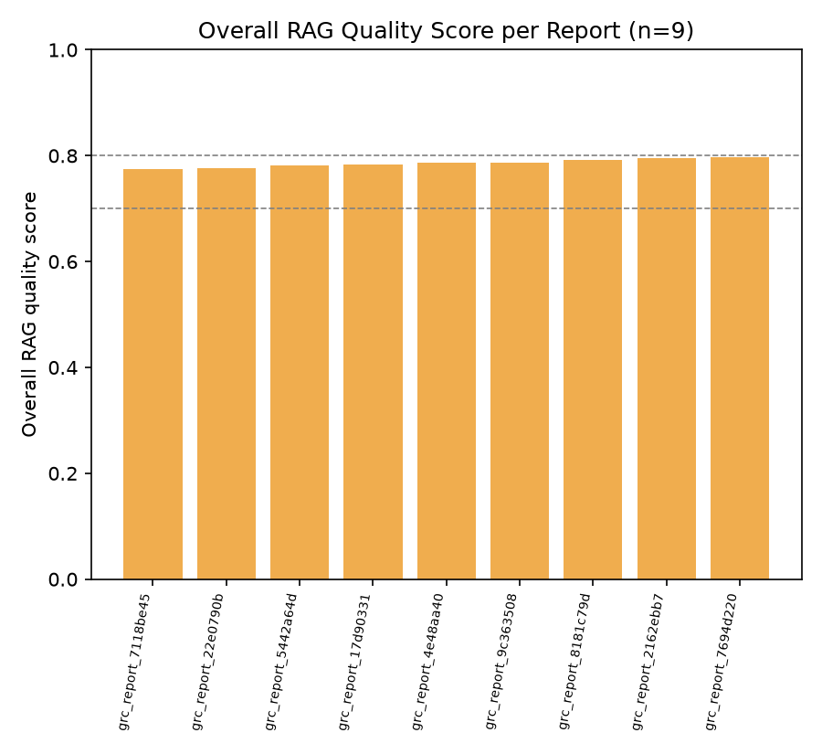
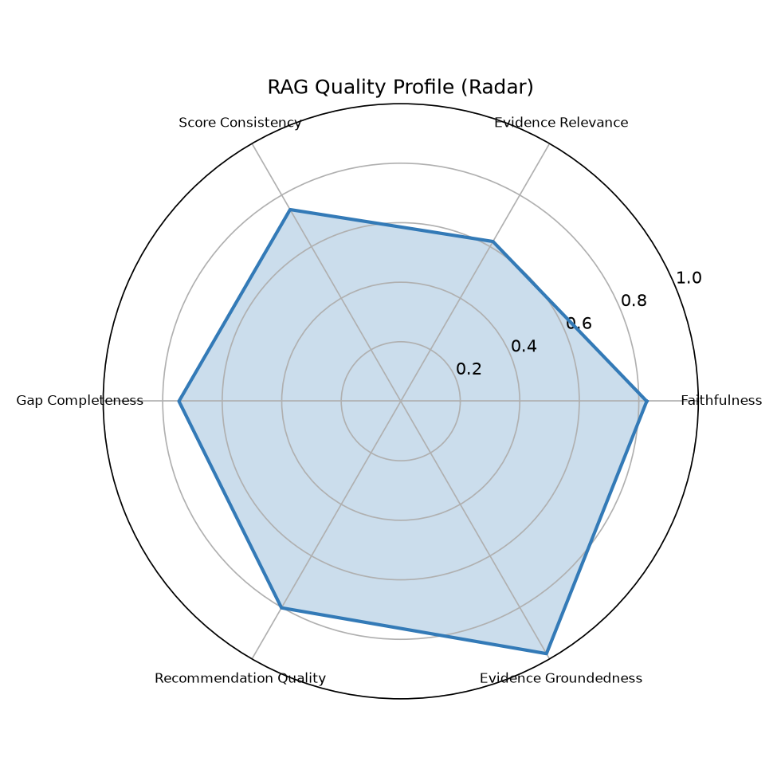
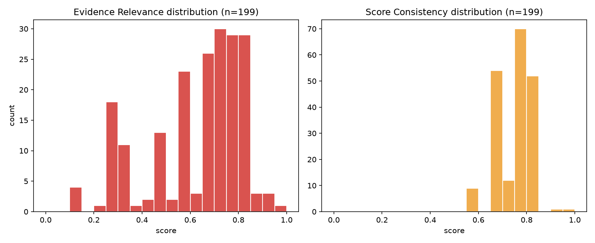

# RAG Quality Report

- Generated: 2026-07-14 01:31 UTC
- Source folder (scanned recursively): `/home/cyberschnell/Documents/GRC-LLM-2/Scott&Scott_Llama_4_Mav_framework_reports`
- RAGAS eval reports found: **9**
- GRC assessment JSON files found: **9**
- Total controls judged (RAGAS): **199**
- Frameworks covered (eval reports): cis_csc, cmmc, csa_ccm, ftc_safeguards, hipaa, iso_27001, nist_800_53, nist_csf, pci_dss

## Overall RAG Quality Score per Report

| Report | Frameworks | Controls | Overall Score | Label |
|---|---|---|---|---|
| grc_report_7118be45_rag_eval.txt | cmmc | 20 | 0.774 | Acceptable |
| grc_report_22e0790b_rag_eval.txt | cis_csc | 18 | 0.777 | Acceptable |
| grc_report_5442a64d_rag_eval.txt | iso_27001 | 24 | 0.781 | Acceptable |
| grc_report_17d90331_rag_eval.txt | pci_dss | 23 | 0.783 | Acceptable |
| grc_report_4e48aa40_rag_eval.txt | nist_csf | 26 | 0.787 | Acceptable |
| grc_report_9c363508_rag_eval.txt | hipaa | 20 | 0.787 | Acceptable |
| grc_report_8181c79d_rag_eval.txt | nist_800_53 | 27 | 0.792 | Acceptable |
| grc_report_2162ebb7_rag_eval.txt | csa_ccm | 25 | 0.795 | Acceptable |
| grc_report_7694d220_rag_eval.txt | ftc_safeguards | 16 | 0.798 | Acceptable |

**Aggregate overall score**: mean=0.786, median=0.787, min=0.774, max=0.798

## Six-Dimension Aggregate Stats (per-control, across all reports)

| Dimension | Mean | Median | Stdev | %<0.5 | %<0.7 | N |
|---|---|---|---|---|---|---|
| Faithfulness | 0.827 | 0.820 | 0.058 | 0.0% | 1.0% | 199 |
| Evidence Relevance | 0.620 | 0.650 | 0.196 | 25.1% | 51.8% | 199 |
| Score Consistency | 0.744 | 0.750 | 0.064 | 0.0% | 12.1% | 199 |
| Gap Completeness | 0.745 | 0.750 | 0.069 | 0.5% | 16.1% | 199 |
| Recommendation Quality | 0.802 | 0.800 | 0.049 | 0.0% | 2.0% | 199 |
| Evidence Groundedness | 0.979 | 1.000 | 0.069 | 0.0% | 1.5% | 199 |

## Worst-Scoring Example Controls per Dimension

**Faithfulness**
- `[0.55]` grc_report_9c363508_rag_eval.txt / 164.310(d)(1): The rationale claims 'limited evidence of measurement, monitoring, or assignment of specific accountability,' but Evidence [4] explicitly states 'A record of the movements of hardware and electronic media and any person responsible therefor,' which directly addresses accountability and tracking — yet the gap about 'no mention of accountability or assignment of roles' contradicts this cited evidence.
- `[0.62]` grc_report_7694d220_rag_eval.txt / FTC-9: The rationale claims 'limited evidence of systematic measurement, monitoring, or ongoing process improvements,' but Evidence [1] explicitly states safeguards 'will regularly monitor the effectiveness of such safeguards' and Evidence [5] describes 'periodic technical and nontechnical evaluations in response to any environmental or operational changes,' directly contradicting the gaps about lack of monitoring and review of safeguards in response to emerging threats.
- `[0.72]` grc_report_17d90331_rag_eval.txt / PCI-7.1: The rationale largely derives from the evidence (authorization, authentication, periodic review are mentioned in quotes [2][4][6]), but claims that 'periodic review' is addressed are partially supported only by quote [4] which mentions reviewing user rights, while the gaps asserting 'no mention of periodic reviews' partially contradict this same quote, creating an internal inconsistency.

**Evidence Relevance** — weakest dimension, showing more examples
- `[0.15]` grc_report_17d90331_rag_eval.txt / PCI-3.1: The three evidence quotes address access control and operational monitoring, which are generic security controls entirely unrelated to the specific PCI-3.1 requirement of minimizing stored account data and implementing retention policies.
- `[0.15]` grc_report_17d90331_rag_eval.txt / PCI-10.6: Neither quote directly addresses time synchronization technology, NTP configuration, or time data protection; they are generic integrity and audit-log review statements with only a very tenuous conceptual link to the control requirement.
- `[0.15]` grc_report_2162ebb7_rag_eval.txt / GRC-05: The three quoted excerpts address general information access authorization, staff training on legal requirements, and protection from alteration/destruction — none of these directly address intellectual property rights or software licensing, making them largely irrelevant to the specific control requirement.
- `[0.15]` grc_report_8181c79d_rag_eval.txt / CM-8: The cited evidence quotes address audit controls, activity log reviews, and risk identification — none of which are directly relevant to the CM-8 requirement of developing and documenting an information system component inventory.
- `[0.20]` grc_report_5442a64d_rag_eval.txt / A.8.1: All three evidence quotes relate to risk identification, risk assessment, and safeguards implementation — none of them address asset identification or inventory management, which is the core requirement of control A.8.1.
- `[0.25]` grc_report_17d90331_rag_eval.txt / PCI-1.3: The evidence quotes are largely generic policy statements (prohibited illegal activities, GSM phone standards, general access privileges) that do not substantively address the specific PCI requirement of restricting network access to the CDE or prohibiting direct public internet access, making most quotes only tangentially relevant.
- `[0.25]` grc_report_4e48aa40_rag_eval.txt / ID.AM-2: None of the four quoted excerpts directly address maintaining a software platform or application inventory; they relate to access control, periodic audits for compliance, contingency plan testing, and application criticality assessment, which are only peripherally related to ID.AM-2's core requirement of inventorying and lifecycle management of software assets.
- `[0.25]` grc_report_4e48aa40_rag_eval.txt / ID.BE-1: The cited quotes address general risk assessment procedures, application criticality, emergency continuity, and safeguard design — none of them directly address supply chain role identification or communication, making them only tangentially relevant to ID.BE-1's specific requirement.
- `[0.25]` grc_report_5442a64d_rag_eval.txt / A.15.1: The cited evidence quotes address general internal/external risk assessments and authentication procedures but do not specifically pertain to supplier relationships, supplier access, or supplier agreements as required by control A.15.1, making them largely tangential to the control's specific requirements.
- `[0.25]` grc_report_7118be45_rag_eval.txt / CM.L2-3.4.1: The cited evidence addresses device/media controls, movement records, backup procedures, and periodic evaluations — none of which directly address establishing or maintaining baseline configurations and inventories throughout the system development life cycle as required by CM.L2-3.4.1.
- `[0.25]` grc_report_7118be45_rag_eval.txt / CM.L2-3.4.2: None of the three cited quotes directly address security configuration settings, baselines, or enforcement mechanisms — they cover auditing rights, periodic evaluations, and logging, which are only tangentially related to CM.L2-3.4.2's specific requirement to establish and enforce configuration settings.
- `[0.25]` grc_report_7118be45_rag_eval.txt / SC.L2-3.13.10: The cited quotes address encryption in a general sense and generic safeguard language, but none specifically address cryptographic key management processes (generation, storage, rotation, destruction, protection), which is the core requirement of SC.L2-3.13.10.

**Score Consistency**
- `[0.55]` grc_report_22e0790b_rag_eval.txt / CIS-10: A score of 3 (defined/managed) is somewhat inflated given that only one evidence quote directly addresses malware defense and there are significant gaps in automated detection, centralized management, and explicit anti-malware tooling requirements; a score of 2 would better reflect the sparse, indirect evidence.
- `[0.55]` grc_report_7118be45_rag_eval.txt / CM.L2-3.4.1: A score of 2 is somewhat generous given that the evidence quotes are only tangentially related to the control requirement and none directly address baseline configurations or lifecycle inventory management; a score of 1 would be more consistent with the near-absence of directly relevant evidence.
- `[0.55]` grc_report_7118be45_rag_eval.txt / SC.L2-3.13.10: A score of 2 is arguably generous given that the evidence quotes contain no substantive coverage of key management lifecycle, protection, or accountability; a score of 1 would better reflect near-absent relevant evidence, though the presence of any encryption-related language provides minimal justification for a 2.

**Gap Completeness**
- `[0.45]` grc_report_9c363508_rag_eval.txt / 164.310(d)(1): The first gap ('no mention of accountability') is directly contradicted by Evidence [4] which references 'any person responsible therefor,' and the gaps miss obvious requirements such as physical access controls for media storage, encryption requirements for media in transit, and breach or incident procedures specific to media loss — reducing overall completeness.
- `[0.55]` grc_report_7694d220_rag_eval.txt / FTC-4: The gap claiming 'no explicit requirement or schedule for regular periodic training updates' is substantially contradicted by Evidence [1] ('periodic security updates') and Evidence [5] ('reviewed and adjusted periodically'), while legitimate gaps around training completion tracking and effectiveness measurement are correctly identified, and the absence of incident-triggered retraining is a valid but underexplored gap.
- `[0.55]` grc_report_7694d220_rag_eval.txt / FTC-9: Several gaps are contradicted by existing evidence (e.g., monitoring effectiveness in [1], periodic evaluations in [5]), and while the gap about disposal detail has some merit, the gap about 'no reference to integration with ongoing risk management' is weakly supported given Evidence [4] and [5]; additionally, the assessment misses an obvious gap around specific customer data lifecycle controls at the collection phase.

**Recommendation Quality**
- `[0.60]` grc_report_9c363508_rag_eval.txt / 164.310(d)(1): Recommendations are reasonably specific and tied to the identified gaps (roles, audits, tracking workflows), but since the first gap is contradicted by the evidence, the corresponding recommendation to 'define accountability' is misaligned, and the suggestions remain somewhat generic without referencing specific tools, timelines, or ownership structures.
- `[0.65]` grc_report_2162ebb7_rag_eval.txt / IAM-08: Recommendations are directionally appropriate and tied to the identified gaps, but they remain somewhat generic (e.g., 'define metrics' without specifying what metrics are relevant to access provisioning) and do not provide actionable specifics such as notification workflows, ticketing system integration, or defined SLAs for provisioning changes.
- `[0.65]` grc_report_9c363508_rag_eval.txt / 164.308(a)(4): The recommendations are actionable and directly tied to the identified gaps around metrics and audits, but they are somewhat generic and do not address the missing HIPAA-specific requirements (e.g., minimum necessary standards, workforce clearance procedures) that should have been flagged as gaps, limiting their overall utility.

**Evidence Groundedness**
- `[0.67]` grc_report_5442a64d_rag_eval.txt / A.6.1: 2/3 quotes located in PDF  [WARNING: possible hallucinated citations]
- `[0.67]` grc_report_7694d220_rag_eval.txt / FTC-3.3: 2/3 quotes located in PDF  [WARNING: possible hallucinated citations]
- `[0.67]` grc_report_7694d220_rag_eval.txt / FTC-3.5: 2/3 quotes located in PDF  [WARNING: possible hallucinated citations]

## Maturity Score Distribution (from GRC assessment JSONs)

Total controls: 199, mean maturity: 2.40 / 5

| Maturity | Count | % |
|---|---|---|
| 0 | 1 | 0.5% |
| 1 | 5 | 2.5% |
| 2 | 108 | 54.3% |
| 3 | 84 | 42.2% |
| 4 | 1 | 0.5% |
| 5 | 0 | 0.0% |

## Charts

## LLM Expert Analysis

# Expert RAG/GRC Quality Analysis

## 1. Overall RAG Quality Verdict

The system delivers **adequate but uneven performance**, with an overall mean quality score of 0.786 across 199 controls and 9 reports. The narrow min-max spread (0.774–0.798) indicates reasonable cross-report consistency at the aggregate level, but this masks significant dimension-level divergence. The system is **not production-ready for high-stakes GRC decisions without human review**, primarily due to a critically weak retrieval layer that undermines the analytical chain even when generation-side outputs appear superficially coherent.

---

## 2. Strongest and Weakest Dimensions

**Strongest: Evidence Groundedness (mean=0.979, median=1.000)**
Near-perfect citation grounding suggests the system reliably anchors responses to retrieved passages rather than fabricating content wholesale. Only 3 controls triggered hallucination warnings (0.67 scores), and all involved one missing citation out of three — a minor but non-trivial risk. This strength is partly misleading: the system cites real text faithfully, but as the retrieval analysis reveals, the cited text is frequently irrelevant.

**Recommendation Quality is also strong (mean=0.802, stdev=0.049, pct<0.7=2.0%)**, indicating generation-side prompting produces coherent, actionable outputs.

**Weakest by significant margin: Evidence Relevance (mean=0.620, median=0.650, stdev=0.196)**
This is the system's critical failure point. **25.1% of controls score below 0.5, and 51.8% score below 0.7** — meaning retrieved evidence is materially off-target for more than half of all assessed controls. The worst-case examples are damning: PCI-3.1 receives access-control evidence; CM-8 receives audit-log evidence; A.8.1 (asset inventory) receives risk-assessment evidence; SC.L2-3.13.10 (cryptographic key management) receives generic encryption policy statements. These represent retrieval failures, not generation failures. The root cause is almost certainly insufficient query specificity, overly broad vector similarity matching, or inadequate chunk-level metadata tagging for control-specific retrieval.

**Faithfulness is the secondary concern (mean=0.827, but pct<0.7=1.0%)**: The worst examples (scores of 0.55–0.62) show the LLM generating rationale that directly contradicts explicit evidence — e.g., claiming "no accountability evidence" when Evidence [4] explicitly names accountability. This is a **generation/prompting failure** (insufficient instruction to cross-check claims against retrieved passages before asserting absence), not a hallucination in the traditional sense. It occurs in ~2–3% of controls based on the distribution but represents a high-severity failure category for GRC work where false-negative findings create compliance risk.

**Score Consistency (mean=0.744) and Gap Completeness (mean=0.745)** are mid-tier but linked to the retrieval problem: when evidence is irrelevant, the model assigns scores and identifies gaps based on policy priors rather than actual organizational evidence, producing inflated scores and phantom gaps.

---

## 3. Maturity Score Calibration — Score Inflation Concern

The maturity distribution is **highly compressed and shows clear inflation signals**:

| Score | Count | % |
|-------|-------|---|
| 0 | 1 | 0.5% |
| 1 | 5 | 2.5% |
| **2** | **108** | **54.3%** |
| **3** | **84** | **42.2%** |
| 4 | 1 | 0.5% |
| 5 | 0 | 0.0% |

**96.5% of all controls are scored 2 or 3**, with essentially zero controls receiving scores of 0, 1, 4, or 5. This bimodal-but-central distribution is statistically implausible for a genuine cross-organizational, multi-framework assessment. It strongly suggests **systematic central-tendency bias** baked into the scoring prompt or model behavior.

This inflation is directly evidenced by the worst-scoring consistency controls: CM.L2-3.4.1 and SC.L2-3.13.10 each received a score of 2 despite evidence that is only tangentially related or entirely irrelevant to the control requirement — the RAGAS evaluator flags that scores of 1 would be more defensible. With 51.8% of controls having Evidence Relevance below 0.7, the model is routinely awarding "defined/partial" scores (2–3) when it effectively has no meaningful organizational evidence to assess. A properly calibrated system with this evidence quality profile should produce substantially more scores of 1 ("ad hoc/initial") and far fewer 3s.

**Estimated calibration error**: Assuming even 30% of controls with Evidence Relevance <0.5 (n≈50) are over-scored by one level, the true mean maturity is closer to 2.1–2.2 rather than 2.40.

---

## 4. Prioritized Recommendations

**Priority 1 — Fix Retrieval (Immediate, High Impact)**
Evidence Relevance at mean=0.620 with 25% of controls below 0.5 is the single largest quality driver. Implement control-specific query expansion: map each control identifier (e.g., CM-8, PCI-3.1) to its canonical requirement keywords and inject these into retrieval queries rather than relying solely on the control description text. Add metadata filtering by domain (e.g., asset management, cryptography, access control) to prevent cross-domain noise. Re-evaluate chunk size — overly large chunks dilute topical signal. Target: Evidence Relevance mean ≥0.75 with pct<0.5 ≤5%.

**Priority 2 — Add Contradiction-Detection Prompting (High Severity, Moderate Effort)**
The Faithfulness failures (0.55, 0.62 scores) share a common pattern: the model asserts absence of evidence that is explicitly present in the retrieved context. Add an explicit prompt step: *"Before stating that evidence does not address X, verify each retrieved passage does not contain language related to X."* A post-generation self-check pass against the evidence set would reduce false-negative findings. Target: eliminate pct<0.7 Faithfulness (currently 1.0%, but each instance is high-severity in GRC).

**Priority 3 — Recalibrate Maturity Scoring Rubric**
Restructure the scoring prompt to explicitly anchor scores to evidence quality: a score of 2 should require at least one directly relevant evidence passage; a score of 3 should require multiple specific, control-aligned passages with measurable implementation detail. Add an explicit instruction: *"If retrieved evidence is only generically related to this control domain, default to score 1 unless direct relevance is demonstrated."* This addresses the 54.3%/42.2% score-compression problem and aligns scoring with the underlying evidence quality distribution.

**Priority 4 — Tighten Gap and Recommendation Generation**
Gap Completeness failures (mean=0.745) are partly driven by gaps being identified based on policy templates rather than evidence, producing contradicted gaps (e.g., FTC-4, FTC-9, 164.310(d)(1)). Add a constraint: *"Do not identify a gap if existing evidence explicitly addresses that requirement."* For Recommendation Quality (mean=0.802, already strong), the remaining weakness is framework-specificity — recommendations should reference the specific regulatory requirement (e.g., "HIPAA minimum necessary standard §164.514(d)") rather than generic best-practice language.

**Priority 5 — Expand Coverage (Low Effort, Long-Term)**
With only 9 reports and 199 controls, the evaluation corpus is small. Expand to ≥50 reports across all target frameworks to detect report-specific or framework-specific retrieval failure patterns that the current 9-report sample may obscure. The stdev on Evidence Relevance (0.196) suggests high per-control variance that may correlate with specific frameworks (PCI and CMMC appear disproportionately represented in worst-case examples).
