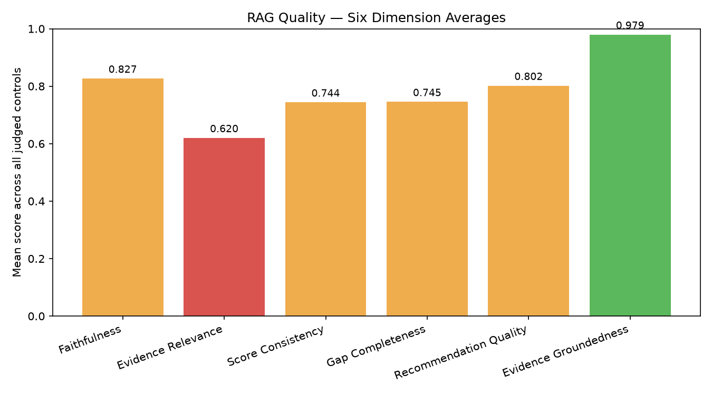
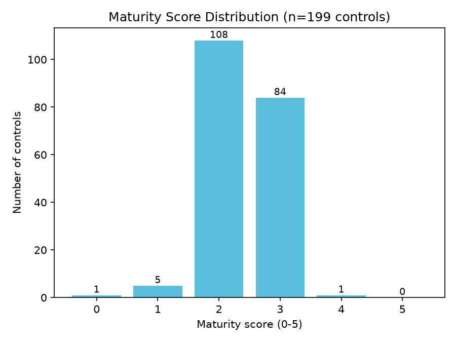

# RAG Quality Report

- Generated: 2026-07-14 01:33 UTC
- Source folder (scanned recursively): `/home/cyberschnell/Documents/GRC-LLM-2/Scott&Scott_Llama_4_Mav_framework_reports`
- RAGAS eval reports found: **9**
- GRC assessment JSON files found: **9**
- Total controls judged (RAGAS): **199**
- Frameworks covered (eval reports): cis_csc, cmmc, csa_ccm, ftc_safeguards, hipaa, iso_27001, nist_800_53, nist_csf, pci_dss

## Overall RAG Quality Score per Report

| Report | Frameworks | Controls | Overall Score | Label |
|---|---|---|---|---|
| grc_report_7118be45_rag_eval.txt | cmmc | 20 | 0.774 | Acceptable |
| grc_report_22e0790b_rag_eval.txt | cis_csc | 18 | 0.777 | Acceptable |
| grc_report_5442a64d_rag_eval.txt | iso_27001 | 24 | 0.781 | Acceptable |
| grc_report_17d90331_rag_eval.txt | pci_dss | 23 | 0.783 | Acceptable |
| grc_report_4e48aa40_rag_eval.txt | nist_csf | 26 | 0.787 | Acceptable |
| grc_report_9c363508_rag_eval.txt | hipaa | 20 | 0.787 | Acceptable |
| grc_report_8181c79d_rag_eval.txt | nist_800_53 | 27 | 0.792 | Acceptable |
| grc_report_2162ebb7_rag_eval.txt | csa_ccm | 25 | 0.795 | Acceptable |
| grc_report_7694d220_rag_eval.txt | ftc_safeguards | 16 | 0.798 | Acceptable |

**Aggregate overall score**: mean=0.786, median=0.787, min=0.774, max=0.798

## Six-Dimension Aggregate Stats (per-control, across all reports)

| Dimension | Mean | Median | Stdev | %<0.5 | %<0.7 | N |
|---|---|---|---|---|---|---|
| Faithfulness | 0.827 | 0.820 | 0.058 | 0.0% | 1.0% | 199 |
| Evidence Relevance | 0.620 | 0.650 | 0.196 | 25.1% | 51.8% | 199 |
| Score Consistency | 0.744 | 0.750 | 0.064 | 0.0% | 12.1% | 199 |
| Gap Completeness | 0.745 | 0.750 | 0.069 | 0.5% | 16.1% | 199 |
| Recommendation Quality | 0.802 | 0.800 | 0.049 | 0.0% | 2.0% | 199 |
| Evidence Groundedness | 0.979 | 1.000 | 0.069 | 0.0% | 1.5% | 199 |

## Worst-Scoring Example Controls per Dimension

**Faithfulness**
- `[0.55]` grc_report_9c363508_rag_eval.txt / 164.310(d)(1): The rationale claims 'limited evidence of measurement, monitoring, or assignment of specific accountability,' but Evidence [4] explicitly states 'A record of the movements of hardware and electronic media and any person responsible therefor,' which directly addresses accountability and tracking — yet the gap about 'no mention of accountability or assignment of roles' contradicts this cited evidence.
- `[0.62]` grc_report_7694d220_rag_eval.txt / FTC-9: The rationale claims 'limited evidence of systematic measurement, monitoring, or ongoing process improvements,' but Evidence [1] explicitly states safeguards 'will regularly monitor the effectiveness of such safeguards' and Evidence [5] describes 'periodic technical and nontechnical evaluations in response to any environmental or operational changes,' directly contradicting the gaps about lack of monitoring and review of safeguards in response to emerging threats.
- `[0.72]` grc_report_17d90331_rag_eval.txt / PCI-7.1: The rationale largely derives from the evidence (authorization, authentication, periodic review are mentioned in quotes [2][4][6]), but claims that 'periodic review' is addressed are partially supported only by quote [4] which mentions reviewing user rights, while the gaps asserting 'no mention of periodic reviews' partially contradict this same quote, creating an internal inconsistency.

**Evidence Relevance** — weakest dimension, showing more examples
- `[0.15]` grc_report_17d90331_rag_eval.txt / PCI-3.1: The three evidence quotes address access control and operational monitoring, which are generic security controls entirely unrelated to the specific PCI-3.1 requirement of minimizing stored account data and implementing retention policies.
- `[0.15]` grc_report_17d90331_rag_eval.txt / PCI-10.6: Neither quote directly addresses time synchronization technology, NTP configuration, or time data protection; they are generic integrity and audit-log review statements with only a very tenuous conceptual link to the control requirement.
- `[0.15]` grc_report_2162ebb7_rag_eval.txt / GRC-05: The three quoted excerpts address general information access authorization, staff training on legal requirements, and protection from alteration/destruction — none of these directly address intellectual property rights or software licensing, making them largely irrelevant to the specific control requirement.
- `[0.15]` grc_report_8181c79d_rag_eval.txt / CM-8: The cited evidence quotes address audit controls, activity log reviews, and risk identification — none of which are directly relevant to the CM-8 requirement of developing and documenting an information system component inventory.
- `[0.20]` grc_report_5442a64d_rag_eval.txt / A.8.1: All three evidence quotes relate to risk identification, risk assessment, and safeguards implementation — none of them address asset identification or inventory management, which is the core requirement of control A.8.1.
- `[0.25]` grc_report_17d90331_rag_eval.txt / PCI-1.3: The evidence quotes are largely generic policy statements (prohibited illegal activities, GSM phone standards, general access privileges) that do not substantively address the specific PCI requirement of restricting network access to the CDE or prohibiting direct public internet access, making most quotes only tangentially relevant.
- `[0.25]` grc_report_4e48aa40_rag_eval.txt / ID.AM-2: None of the four quoted excerpts directly address maintaining a software platform or application inventory; they relate to access control, periodic audits for compliance, contingency plan testing, and application criticality assessment, which are only peripherally related to ID.AM-2's core requirement of inventorying and lifecycle management of software assets.
- `[0.25]` grc_report_4e48aa40_rag_eval.txt / ID.BE-1: The cited quotes address general risk assessment procedures, application criticality, emergency continuity, and safeguard design — none of them directly address supply chain role identification or communication, making them only tangentially relevant to ID.BE-1's specific requirement.
- `[0.25]` grc_report_5442a64d_rag_eval.txt / A.15.1: The cited evidence quotes address general internal/external risk assessments and authentication procedures but do not specifically pertain to supplier relationships, supplier access, or supplier agreements as required by control A.15.1, making them largely tangential to the control's specific requirements.
- `[0.25]` grc_report_7118be45_rag_eval.txt / CM.L2-3.4.1: The cited evidence addresses device/media controls, movement records, backup procedures, and periodic evaluations — none of which directly address establishing or maintaining baseline configurations and inventories throughout the system development life cycle as required by CM.L2-3.4.1.
- `[0.25]` grc_report_7118be45_rag_eval.txt / CM.L2-3.4.2: None of the three cited quotes directly address security configuration settings, baselines, or enforcement mechanisms — they cover auditing rights, periodic evaluations, and logging, which are only tangentially related to CM.L2-3.4.2's specific requirement to establish and enforce configuration settings.
- `[0.25]` grc_report_7118be45_rag_eval.txt / SC.L2-3.13.10: The cited quotes address encryption in a general sense and generic safeguard language, but none specifically address cryptographic key management processes (generation, storage, rotation, destruction, protection), which is the core requirement of SC.L2-3.13.10.

**Score Consistency**
- `[0.55]` grc_report_22e0790b_rag_eval.txt / CIS-10: A score of 3 (defined/managed) is somewhat inflated given that only one evidence quote directly addresses malware defense and there are significant gaps in automated detection, centralized management, and explicit anti-malware tooling requirements; a score of 2 would better reflect the sparse, indirect evidence.
- `[0.55]` grc_report_7118be45_rag_eval.txt / CM.L2-3.4.1: A score of 2 is somewhat generous given that the evidence quotes are only tangentially related to the control requirement and none directly address baseline configurations or lifecycle inventory management; a score of 1 would be more consistent with the near-absence of directly relevant evidence.
- `[0.55]` grc_report_7118be45_rag_eval.txt / SC.L2-3.13.10: A score of 2 is arguably generous given that the evidence quotes contain no substantive coverage of key management lifecycle, protection, or accountability; a score of 1 would better reflect near-absent relevant evidence, though the presence of any encryption-related language provides minimal justification for a 2.

**Gap Completeness**
- `[0.45]` grc_report_9c363508_rag_eval.txt / 164.310(d)(1): The first gap ('no mention of accountability') is directly contradicted by Evidence [4] which references 'any person responsible therefor,' and the gaps miss obvious requirements such as physical access controls for media storage, encryption requirements for media in transit, and breach or incident procedures specific to media loss — reducing overall completeness.
- `[0.55]` grc_report_7694d220_rag_eval.txt / FTC-4: The gap claiming 'no explicit requirement or schedule for regular periodic training updates' is substantially contradicted by Evidence [1] ('periodic security updates') and Evidence [5] ('reviewed and adjusted periodically'), while legitimate gaps around training completion tracking and effectiveness measurement are correctly identified, and the absence of incident-triggered retraining is a valid but underexplored gap.
- `[0.55]` grc_report_7694d220_rag_eval.txt / FTC-9: Several gaps are contradicted by existing evidence (e.g., monitoring effectiveness in [1], periodic evaluations in [5]), and while the gap about disposal detail has some merit, the gap about 'no reference to integration with ongoing risk management' is weakly supported given Evidence [4] and [5]; additionally, the assessment misses an obvious gap around specific customer data lifecycle controls at the collection phase.

**Recommendation Quality**
- `[0.60]` grc_report_9c363508_rag_eval.txt / 164.310(d)(1): Recommendations are reasonably specific and tied to the identified gaps (roles, audits, tracking workflows), but since the first gap is contradicted by the evidence, the corresponding recommendation to 'define accountability' is misaligned, and the suggestions remain somewhat generic without referencing specific tools, timelines, or ownership structures.
- `[0.65]` grc_report_2162ebb7_rag_eval.txt / IAM-08: Recommendations are directionally appropriate and tied to the identified gaps, but they remain somewhat generic (e.g., 'define metrics' without specifying what metrics are relevant to access provisioning) and do not provide actionable specifics such as notification workflows, ticketing system integration, or defined SLAs for provisioning changes.
- `[0.65]` grc_report_9c363508_rag_eval.txt / 164.308(a)(4): The recommendations are actionable and directly tied to the identified gaps around metrics and audits, but they are somewhat generic and do not address the missing HIPAA-specific requirements (e.g., minimum necessary standards, workforce clearance procedures) that should have been flagged as gaps, limiting their overall utility.

**Evidence Groundedness**
- `[0.67]` grc_report_5442a64d_rag_eval.txt / A.6.1: 2/3 quotes located in PDF  [WARNING: possible hallucinated citations]
- `[0.67]` grc_report_7694d220_rag_eval.txt / FTC-3.3: 2/3 quotes located in PDF  [WARNING: possible hallucinated citations]
- `[0.67]` grc_report_7694d220_rag_eval.txt / FTC-3.5: 2/3 quotes located in PDF  [WARNING: possible hallucinated citations]

## Maturity Score Distribution (from GRC assessment JSONs)

Total controls: 199, mean maturity: 2.40 / 5

| Maturity | Count | % |
|---|---|---|
| 0 | 1 | 0.5% |
| 1 | 5 | 2.5% |
| 2 | 108 | 54.3% |
| 3 | 84 | 42.2% |
| 4 | 1 | 0.5% |
| 5 | 0 | 0.0% |

## Charts

## LLM Expert Analysis

# Expert RAG/GRC Quality Audit Analysis

## 1. Overall RAG Quality Verdict

The system delivers **moderate-to-acceptable overall quality** (mean 0.786, range 0.774–0.798 across nine reports), with remarkably low inter-report variance (range of only 0.024). This tight clustering suggests the system is consistent but systematically bounded — it is not producing occasional catastrophic failures, but it is also not breaking through a quality ceiling. The aggregate score masks a critical structural weakness: a single dimension (Evidence Relevance, mean 0.620) is dragging the composite down and represents a fundamental architectural problem, not merely a tuning issue.

## 2. Strongest and Weakest Dimensions

**Strongest: Evidence Groundedness (mean 0.979, median 1.000, pct<0.7 = 1.5%)**
Nearly all cited evidence quotes can be physically located in source documents. This is a meaningful finding — the system is not fabricating citations at scale. The three flagged 0.67-scored controls (one citation unverifiable per control) represent isolated incidents rather than a systemic hallucination pattern. **The retrieval pipeline's citation integrity is the system's most reliable property.**

**Second strongest: Faithfulness (mean 0.827, pct<0.7 = 1.0%) and Recommendation Quality (mean 0.802, pct<0.7 = 2.0%)**
Generation quality is generally sound. The LLM is largely staying within the bounds of what evidence supports, and its recommendations are directionally appropriate. However, the three worst Faithfulness examples (scores 0.55–0.72) reveal a specific failure mode: the model generates rationales that **contradict explicit evidence content** — claiming "limited evidence" for something a retrieved quote directly states. This is a generation/prompting failure (likely insufficient instruction to cross-check rationale claims against all retrieved quotes before finalizing output), not a retrieval failure.

**Weakest by far: Evidence Relevance (mean 0.620, stdev 0.196, pct<0.5 = 25.1%, pct<0.7 = 51.8%)**
This is the system's critical failure point and is unambiguously a **retrieval problem**. Over one quarter of controls have evidence relevance below 0.5, and more than half fall below 0.7. The worst examples are stark: PCI-3.1 (data minimization) receives generic access-control quotes; CM-8 (component inventory) receives audit-log quotes; A.8.1 (asset inventory) receives risk-assessment quotes; SC.L2-3.13.10 (key management) receives generic encryption policy language. These are not near-misses — they are fundamental topical mismatches. The retrieval mechanism is evidently using **semantically broad embedding similarity** without sufficient control-specific query formulation or re-ranking. Controls with narrow, technical scopes (PCI data retention specifics, NIST configuration baselines, cryptographic key lifecycle) are systematically under-served. The high stdev (0.196) further indicates that retrieval quality is highly control-dependent rather than uniformly poor, suggesting the problem is concentrated in technically specific or less-common control domains.

**Score Consistency (mean 0.744) and Gap Completeness (mean 0.745)** sit at middling quality, and notably, their failures are **downstream of Evidence Relevance failures**: when the retrieved evidence is irrelevant, maturity scores become unanchored and gap analyses either fabricate gaps (contradicted by actual evidence) or miss real requirements entirely. This is a propagating defect.

## 3. Maturity Score Distribution and Calibration

The distribution (mean 2.40; counts: 0×1, 1×5, 2×108, 3×84, 4×1, 5×0) is **significantly compressed and likely inflated**. Several calibration concerns stand out:

- **Score 2 dominates at 54.3%** of all controls, functioning as a de facto default answer rather than a discriminating judgment. Combined with score 3 (42.2%), fully 96.5% of controls cluster in a two-point band.
- **Scores 0, 1, 4, and 5 are nearly absent** (total: 7 controls, 3.5%), which is implausible for a diverse 199-control corpus spanning multiple frameworks (HIPAA, PCI-DSS, NIST, FTC Safeguards, ISO 27001, CMMC). Real enterprise compliance portfolios rarely show such uniformity.
- The Score Consistency worst cases explicitly identify inflation: CM.L2-3.4.1 and SC.L2-3.13.10 both scored 2 when the RAGAS evaluator assessed scores of 1 as more appropriate given near-absent relevant evidence. CIS-10 scored 3 when 2 was deemed warranted.
- **The inflation mechanism is traceable**: when retrieved evidence is irrelevant (the dominant failure mode), the model cannot distinguish "control is partially implemented" from "control has no evidence" — and appears to default to score 2 rather than score 1 or 0. This is a direct consequence of the retrieval problem manifesting in score outputs.

The distribution does not reflect genuine organizational maturity differentiation. It reflects a system that, lacking adequate evidence, gravitates toward the middle of the scale.

## 4. Concrete Prioritized Recommendations

**Priority 1 — Overhaul the retrieval strategy (addresses Evidence Relevance, root cause of cascade failures)**
The single highest-ROI intervention. Replace or augment the current embedding-similarity retrieval with **control-aware query expansion**: decompose each control into its specific technical sub-requirements before retrieval (e.g., for SC.L2-3.13.10, query explicitly for "key generation," "key rotation," "key destruction," "key storage procedures," not just "cryptographic controls"). Add a **re-ranking step** using a cross-encoder or LLM-based relevance judge to filter retrieved passages below a relevance threshold (suggest ≥0.6) before they enter the generation context. Target: reduce pct<0.5 Evidence Relevance from 25.1% to under 5%.

**Priority 2 — Implement a contradiction-check prompting step (addresses Faithfulness failures and Gap Completeness errors)**
Before finalizing rationale and gap text, add an explicit chain-of-thought instruction requiring the model to enumerate each claim and verify it against all retrieved quotes, flagging any claim that contradicts or overstates the absence of evidence. The 0.55 Faithfulness cases (e.g., 164.310(d)(1), FTC-9) demonstrate the model is not performing this check. A targeted verification prompt would catch "limited evidence of X" claims when X is directly stated in the retrieved text. This is a low-cost prompting change with high impact on both Faithfulness and Gap Completeness accuracy.

**Priority 3 — Recalibrate maturity scoring with explicit score anchors and evidence-sufficiency gates (addresses score inflation)**
Add a scoring rubric that explicitly instructs: "If fewer than N retrieved passages are topically relevant to this control's core requirement, the score cannot exceed 1." Define quantitative anchors — for example, score 3 requires at least two pieces of evidence demonstrating process execution (not just policy existence) with measurable outcomes. The current compression around 2–3 indicates the model lacks sufficient discriminatory guidance. Audit a calibration set of ~30 controls with human-assigned scores to validate recalibrated outputs.

**Priority 4 — Address citation hallucination in isolated cases (addresses Evidence Groundedness outliers)**
For the three 0.67-scored controls with unverifiable citations, implement a post-generation verification step that fuzzy-matches all quoted text against the source document. Any quote failing verification should either be removed or flagged with a confidence warning in the output JSON. Given the overall groundedness score is excellent (0.979), this is a targeted fix rather than a systemic one, but citation fabrication in a GRC compliance context carries disproportionate risk to organizational reliance on outputs.

**Priority 5 — Framework-specific retrieval tuning for under-performing control families**
The worst Evidence Relevance cases cluster around specific control types: configuration management (CM-8, CM.L2-3.4.1, CM.L2-3.4.2), asset inventory (A.8.1, ID.AM-2), supplier management (A.15.1), and cryptographic key management (SC.L2-3.13.10). Build a control-family taxonomy and associate each family with curated retrieval keywords and domain-specific passage filters. This targeted tuning will address the highest-severity retrieval gaps with bounded effort.
